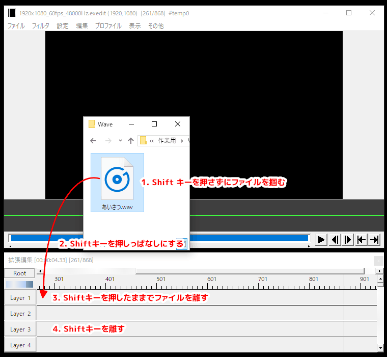
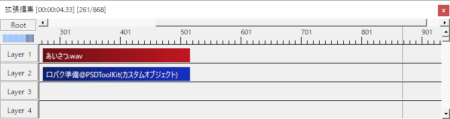
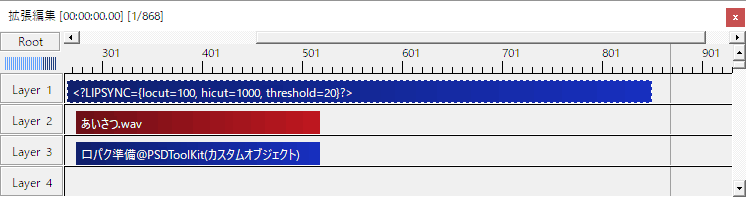

# 音声の処理について

PSDToolKit は PSD ファイルを表示するためのツールキットですが、PSD ファイルを使った作業の先には音声が関わる処理もあるため、音声に連動した口パク（リップシンク）アニメーションや、字幕表示をするための補助機能なども含んでいます。

このドキュメントでは PSDToolKit が提供する音声に関連する処理を網羅的に紹介します。

# 音声に合わせた口パク（リップシンク）

PSDToolKit では、音声に合わせて口パク（リップシンク）を行うために `口パク準備` という `カスタムオブジェクト` を提供しています。

これを使うと `*.wav` ファイルの音量を元に「現在トーク中かどうか」を取得したり、`*.lab` ファイルを元に発音中の音素情報を得ることができるようになります。

なお、`口パク準備` はその名の通り準備を行うためのオブジェクトなので、これ単体では何もできません。

ここで取得したデータを使うには、[口パク（リップシンク）を設定する](faview.md#口パク（リップシンク）を設定する)の項を参照してください。

## 口パク準備の使い方

`口パク準備` は拡張編集の右クリックメニューから `メディアオブジェクトの追加`→`PSDToolKit`→`口パク準備` で挿入できます。


プロパティ名|説明
---|---
`ローカット`|音声の音量を取得する際に指定した周波数以下をカットしたあとの値を取得します。
`ハイカット`|音声の音量を取得する際に指定した周波数以上をカットしたあとの値を取得します。
`しきい値`|どのくらいの音量以上なら発言中として扱うかを指定します。<br>オーディオに声以外のノイズが含まれている場合はある程度大きな値に設定しないと誤認識することがあります。
`参照`|処理を行う対象の `*.wav` ファイルを指定します。<br>同じフォルダに同じ名前の `*.lab` ファイルがある場合は自動的に音素データも読み込まれます。

### `*.lab` ファイルとは

```
0 1150000 k
1150000 2400000 o
2400000 2900000 N
2900000 3450000 n
3450000 4350000 i
4350000 5250000 ch
5250000 5850000 i
5850000 6450000 w
6450000 7950000 a
```

上記のように音素のタイミング情報が 1/10,000,000 秒単位で書かれたシンプルなテキストベースのファイルです。

### 口パク準備を効率よく作成するには

大抵のニーズにおいては音声が流れている時間と同じ区間に同じファイルを読み込んだ口パク準備を配置したいはずなので、PSDToolKit ではより簡単に `口パク準備` を作成できる方法を提供しています。



1. **Shift キーを押さずにファイルを掴む**  
まずは普通にファイルを掴みます。  
ここで Shift キーが押されているとエクスプローラーなどの挙動が変わってしまうため、必ず Shift キーを離した状態でファイルを掴む必要があります。
2. **Shift キーを押しっぱなしにする**  
ファイルを掴んだまま、Shift キーを押しっぱなしにします。
3. **Shift キーを押したままでファイルを離す**  
Shift キーを押したままで、拡張編集へファイルを投げ込みます。  
この時点で `音声` のオブジェクトの下に `口パク準備` のオブジェクトが作成され、グループ化された状態になっています。
4. **Shift キーを離す**  
ドロップが完了した時点で Shift キーは離して構いません。

実際には Shift キーを押し始めるタイミングにだけ注意すればいいだけなので、簡単な操作です。



このように、オーディオと同じ位置に同じ時間の範囲で `口パク準備` が作成されます。

この `口パク準備` はオーディオとのグループ化も行われているため、どちらか片方を掴んで移動しても一緒に動きます。

#### 自動作成される `口パク準備` のパラメーターの初期設定を変更する

自動的に作成される `口パク準備` は、`ローカット`/`ハイカット`/`しきい値`が初期設定のままになっています。

これを変更するためには個々の `口パク準備` のパラメーターを書き換えるような方法でももちろん対応可能ですが、このようなケースに対応するための仕組みが用意されています。

```
<?LIPSYNC={locut=100, hicut=1000, threshold=20}?>
```



このような `テキスト` オブジェクトを口パク準備より上のレイヤーに置いておくと、個々の設定を書き換えなくても一括で設定値を上書きできます。

## `*.lab` ファイルのもうひとつの使い方

通常 `*.lab` ファイルは `*.wav` ファイルと同じ名前で配置しておけば自動的に利用されますが、もっと細かく制御を行いたい場合は拡張編集のタイムラインに対して直接ドラッグ＆ドロップして読み込むこともできます。


`*.lab` ファイルをドラッグ＆ドロップすると、このように音素がひとつひとつタイムラインに挿入されます。

個々の音素を書き換えたり長さや位置の変更なども拡張編集上で行えるため、必要に応じて微調整が可能です。

ここに挿入されたデータは `口パク準備` と同じようにアニメーションなどの用途で利用可能ですが、以下のような細かな違いもあります。

- **現在地点の前後の音素情報が参照できない**  
`口パク準備` で `*.lab` ファイルを読んでいる時は参照できますが、この方法だと前後の音素は参照できません。
- **`*.wav` ファイルの音量が取得できない**  
この方法では `*.wav` ファイルは一切参照していないため、音量データへのアクセスはできません。

# 音声に合わせた字幕表示

音声が流れている間だけ、喋っている内容を字幕で表示したいケースがあります。

拡張編集の標準機能でテキストを表示することはできますが、手動でやると表示する時間の設定などを毎回行うことになり手間が少なくありません。

また、フォント設定や表示する位置なども個々の `テキスト` オブジェクトが保持しているので、これらを変更する作業はどうしても煩雑になりがちです。

PSDToolKit が提供する `字幕準備` と `字幕表示` という概念によって、ある程度の煩雑さを回避することができます。

## 字幕準備の使い方

`字幕準備` の実体はスクリプトが記述されたただの `テキスト` オブジェクトです。  
このドキュメントでは便宜上これを `字幕準備` と呼びます。


1. **`*.wav` ファイルと同じ名前の `*.txt` ファイルを作成**  
字幕として入力したい内容が書かれた `*.txt` ファイルを作成します。  
標準設定ではテキストファイルの文字エンコーディングは `Shift_JIS` であるものとして処理しますが、[`P.wav_subtitleencoding`](setting.md#P.wav_subtitleencoding) を設定することにより `UTF-8` にも変更可能です。
2. **Shift キーを押しながら `*.wav` ファイルをドロップ**  
[口パク準備を効率よく作成するには](#口パク準備を効率よく作成するには)の項で行ったのと同じ方法でドロップを行うと、自動的に `字幕準備` オブジェクトが作成されます。  
`*.txt` ファイルを一緒に掴む必要はなく、`*.wav` ファイルのみを掴みます。

このようにすると、`口パク準備` の下にスクリプトと共にテキストが書かれたオブジェクトが一緒に追加されます。

なお、`字幕準備` はその名の通り準備を行うためのものなので、これ単体では何もできません。

### `字幕準備` の代わりに `テキスト` を挿入するには

編集時の利便性を考慮しデフォルトでは `字幕準備` を挿入する設定になっていますが、[`P.wav_insertmode`](setting.md#P.wav_insertmode) を `1` に設定すると素のテキストを挿入することもできます。

この使い方の延長線上には `テキスト` オブジェクトの設定を予め変更しておいたりフィルタ効果などを予め設定しておきたいニーズもあるかもしれません。  
この用途においては `script\PSDToolKit\exa\subtitle.exa` ファイルを差し替えるとテンプレートとして使われるエイリアスファイルを変更したり、[`P.wav_exafinder`](setting.md#P.wav_exafinder) の設定を使うとドロップしたファイル名に応じて使われるエイリアスファイルを切り替えたりすることができます。

### `口パク準備` を作らずに `字幕準備` を挿入するには

`*.wav` ファイルをドロップした時に `口パク準備` を作らずに `字幕準備` だけを作成する方法は用意されていません。

`口パク準備` が配置されるレイヤー全体を非表示にすれば動作を無効化できるため、負荷はかからなくなります。

## 字幕準備で設定された字幕を表示する

`字幕準備` で設定したテキストは、字幕表示を行うための `テキスト` オブジェクトを使って表示します。  
このドキュメントでは便宜上これを `字幕表示` と呼びます。

`字幕表示` を挿入するには拡張編集の右クリックメニューから `メディアオブジェクトの追加`→`PSDToolKit`→`テキスト　字幕表示用` を選びます。


`字幕表示` が挿入された状態のスクリーンショットです。

このスクリーンショットでは `字幕準備` のオブジェクトが置かれているのは `Layer 3` なので、`字幕表示` 側で `layer = 3` として `字幕準備` の位置を指定しています。

これで `字幕準備` で設定したテキストが画面に表示されるようになり、さらに表示位置やフォント設定などは `字幕表示` 側のオブジェクトで設定できるようになりました。

### `字幕表示` でのアニメーション効果

`字幕表示` で字幕を表示すると拡張編集側が用意した `obj.time`/`obj.frame`/`obj.totaltime`/`obj.totalframe` が本来欲しい値とは異なってしまうため、これらを利用した `アニメーション効果` などは意図した動作にはならなくなってしまいます。

しかし `字幕表示` では代わりに `subtitle.time`/`subtitle.frame`/`subtitle.totaltime`/`subtitle.totalframe` を用意しており、代わりにこれを使うことによって `アニメーション効果` は通常通りに実現可能です。

そのデモンストレーション用として、PSDToolKit には `字幕表示フェード` という `アニメーション効果` が付属しています。


プロパティ名|説明
---|---
`速さ(秒)`|フェードイン／アウトする速さを秒で指定します。
`間隔(秒)`|`文字毎に個別オブジェクト` を有効にした際にずらす時間を秒で指定します。
`拡大率`|フェード時に拡大率を変更させる場合に指定します。
`X座標`|フェード時にX座標を移動させる場合に指定します。
`フェードアウトはシンプル`|フェードアウト時に `間隔(秒)` / `拡大率` / `X座標` の設定値を無視します。

この `アニメーション効果` を `字幕表示` に追加し `文字毎に個別オブジェクト` を有効にすれば、簡単にアニメーションが設定できます。

# オーディオの調整

拡張編集では音声に対して行える操作は少なく、オーディオを扱うことを主軸としたソフトのようにイコライザーなどを使うことはできませんが、イコライザーやコンプレッサーなどで音量をコントロールできるとバランスの取れた動画が作りやすくなります。

また、動画を編集する上で複数の音声を合成していく場合、音割れ防止用にマスターにリミッターを入れたりできると便利です。

PSDToolKit では `チャンネルストリップ` / `Aux1 チャンネルストリップ` / `マスターチャンネルストリップ` という、上記を実現するための AviUtl プラグインを提供しています。

## `チャンネルストリップ`

`チャンネルストリップ` は拡張編集上の音声に対してエフェクターなどを提供するフィルタオブジェクトです。

`チャンネルストリップ` は拡張編集の右クリックメニューから `フィルタオブジェクトの追加`→`チャンネルストリップ` で挿入できます。


プロパティ名|説明
---|---
`ID`|チャンネルストリップを識別する番号を指定します。<br>チャンネルストリップを使用する時は、同じ時間軸で重複しない `0` 以上の `ID` を指定する必要があります。<br>つまり縦に `ID: 0` が２つあるのはまずいですが、横に `ID: 0` が２つあるのは問題ありません。
`入力音量`|エフェクターに通す前の音量を指定します。
`遅延`|音声を遅らせる時間をミリ秒でします。
`EQ LoFreq`|イコライザーで音量調整したい周波数帯を指定します。
`EQ LoGain`|`EQ LoFreq` で指定した周波数帯の音量を調整します。
`EQ HiFreq`|イコライザーで音量調整したい周波数帯を指定します。
`EQ HiGain`|`EQ HiFreq` で指定した周波数帯の音量を調整します。
`C Thresh`|コンプレッサーのスレッショルド（どの程度の大きさを超えたらコンプレッサーで圧縮するか）を指定します。
`C Ratio`|コンプレッサーのレシオ（どの程度圧縮するか）を指定します。
`C Attack`|コンプレッサーのアタック（どのぐらいの速さで音量が圧縮されるか）を指定します。
`C Release`|コンプレッサーのリリース（どのぐらいの速さで音量が戻るか）を指定します。
`Aux1Send`|`Aux1 チャンネルストリップ`に送る音の大きさを指定します。
`出力音量`|エフェクターに通した後の音量を指定します。

全ての設定は初期値では何も行わないようになっています。

なお AviUtl のメインメニューから `設定`→`チャンネルストリップの設定` を選ぶと、現在時刻における設定値を単位付きで確認できます。


### チャンネルストリップの使い方

チャンネルストリップは設置した場所よりも上に置いたオーディオが処理対象になります。

また、複数のチャンネルストリップを配置したときは、前のチャンネルストリップから次のチャンネルストリップまでの間に設置されたオーディオが処理対象になります。


このように `チャンネルストリップ` を３つ設定した場合、この黄色く着色したゾーンがそれぞれの `チャンネルストリップ` の影響範囲になります。

### 音声ファイル側で音量を大きくしない

チャンネルストリップを使うときは、音声ファイル側で音量を大きくするべきではありません。  
（小さくするのは問題ありません）


このパラメータは、音を大きくする用途で使うとピークを超えた時に音が割れてしまいます。

`チャンネルストリップ` の `入力音量` や `出力音量` では内部では 32bit float で処理しているため、音声ファイル側だと音が割れるほどの音量になっても、その時点で音が割れることはありません。

また、`チャンネルストリップ` が処理したそれぞれの音声は最終的には合成されますが、その時点で音が割れるほど大きい場合は `リミッター` エフェクタが適切に音量を絞るため、相対的に他の音が小さくなることはあっても基本的に音は割れない仕組みになっています。

## `Aux1 チャンネルストリップ`

`Aux1 チャンネルストリップ` はセンドエフェクトの仕組みを実現するためのフィルタオブジェクトです。

現在は実験的なリバーブのみが実装されています。


プロパティ名|説明
---|---
`R PreDly`|リバーブの残響が始まるまでの時間を指定した分だけ遅延させます。<br>大きな部屋では音が反射するまでの距離も遠くなるので、大きな部屋をシミュレートする場合はこの値を大きくします。
`R Decay`|リバーブの残響の長さです。
`R LPFreq`|リバーブの残響に設定するローパスフィルターの周波数を指定します。<br>この値を大きくすれば残響の音が明るく、小さくすれば暗くなります。
`R HPFreq`|リバーブの残響に設定するハイパスフィルターの周波数を指定します。<br>この値を大きくすれば残響の音が軽く、小さくすれば重くなります。

### 注意事項

`Aux1 チャンネルストリップ` は `音声波形表示` などと相性が悪く、残響の音がおかしくなりますが、これは仕様です。

`音声波形表示` など一部のフィルターは時間軸に対してバラバラにデータを返さなくてはいけなくなるため、現在の実装では綺麗に対処できなくなるためです。

### `Aux1 チャンネルストリップ` の使い方

まず `チャンネルストリップ` にある `Aux1Send` パラメーターを用いて、音声データを `Aux1 チャンネルストリップ` に対して送信します。

同じ時間軸上に `Aux1 チャンネルストリップ` を設置し、各種パラメーターを設定することでリバーブが利用可能になります。

## `マスターチャンネルストリップ`

`マスターチャンネルストリップ` は内部で自動的に使われているフィルタで、`チャンネルストリップ` で回収した各トラックのデータを `マスターチャンネルストリップ` が合成することでひとつの音声として出力します。

また、`マスターチャンネルストリップ` にはリミッターが内蔵されており、音が割れそうな時は全体の音量を下げることで音自体が割れるのを回避します。