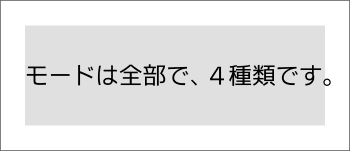
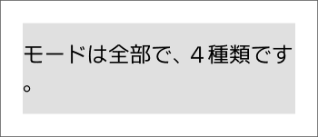
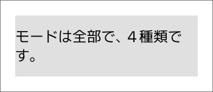
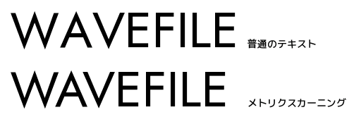
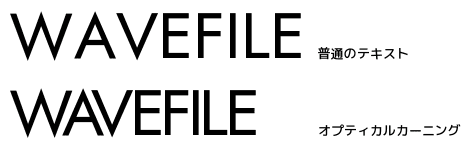
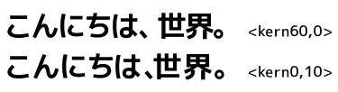

# はじめに

[`字幕表示`](obj.md#字幕表示)、[`字幕表示（キャッシュ）`](obj.md#字幕表示（キャッシュ）)、[`自動折り返しテキスト`](obj.md#自動折り返しテキスト) には同じような設定項目があり、上手く活用することで処理効率や作業効率を向上させることができる、かもしれません。

```lua
cache = {          -- キャッシュ設定
    mode = 0      ,-- キャッシュモード（通常は変更不要） | -1 無効 | 0 選択時のみ無効 | 1 有効
    save = 3      ,-- 保存場所（通常は変更不要、0-3）
},
wordwrap = {       -- テキストの自動折り返し
    mode = 3      ,-- 0 しない | 1 する | 2 禁則処理 | 3 文節区切り
    width = 10000 ,-- 折り返す幅
    model = "ja"  ,-- 読み込む BudouX モデル
},
```

このページでは各種設定や使い方などについて説明します。

# キャッシュ設定

「文字を表示する」というのはそれなりに重い処理で、表示のために作ったデータを捨てずに再利用できれば効率が良くなります。  
キャッシュ設定は、そのような再利用を行うための設定です。

設定名|説明
---|---
`cache.mode`|キャッシュを有効にするかを設定します。<br>通常の用途では `0` が最適な設定です。<br>`-1` - 常時無効<br>`0` - オブジェクトを選択していなければ有効<br>`1` - 常時有効
`cache.save`|キャッシュデータを保存する場所を設定します。<br>通常の用途では `3` が最適な設定です。<br>`0` - AviUtl のメモリ上に配置（AviUtlのメモリ空間を圧迫する）<br>`1` - 外部プロセスに保存（AviUtlのメモリ空間を圧迫しないが少し遅い）<br>`2` - `0` の機能 + 拡張編集のキャッシュも使う<br>`3` - `1` の機能 + 拡張編集のキャッシュも使う

[`字幕表示`](obj.md#字幕表示) はキャッシュ機構を持たないため、この設定はありません。

# テキストの自動折り返し

長いテキストはそのまま何もしなければ画面からはみ出しますが、自動的に改行して折り返すことができる `自動折り返し` という機能があります。

設定名|説明
---|---
`wordwrap.mode`|テキストの自動折り返しに関する設定です。<br>`0` - 自動折り返ししない<br>`1` - 自動折り返しする<br>`2` - 禁則処理付きで自動折り返しする<br>`3` - 文節を考慮して禁則処理付きで自動折り返しする
`wordwrap.width`|自動折り返しの幅を指定します。<br>`wordwrap.mode` が `0` の場合は無視されます。
`wordwrap.model`|使用する BudouX モデルを指定します。<br>`"ja"` - 日本語モデル<br>`JSONファイルへのパス` - カスタムモデルを読み込みます。<br>※ この設定は `wordwrap.mode = 3` のときのみ有効です。

`<kern>` などの一部の制御文字を使いたい場合にも自動折り返しを有効にする必要があります。  
制御文字を使いたいが折り返したくないときは、折り返しが発生しない程度まで `wordwrap.width` を広げてください。

なお自動折り返しは [`折り返し制御`](#折り返し制御) を行うことで折り返しポイントを指定することもできます。

## 自動折り返しのモードについて

自動折り返しには４つのモードがあり、以下のように挙動が変化します。

### `0` - 自動折り返ししない



- 自動折り返しを完全に無効化します。
- 拡張編集における通常のテキストと同じような挙動です。
- `<nobr>` や `<wbr>` や `<kern>` などの制御文字は使用できません。

### `1` - 自動折り返しする



- `wordwrap.width` で指定された幅を超える場合に自動折り返しを行います。
- 最も単純な折り返しモードです。

### `2` - 禁則処理付きで自動折り返しする



- `wordwrap.width` で指定された幅を超える場合に自動折り返しを行います。
- 行末禁則や行頭禁則などが適用されます。<br>例えば行が `「` などで終わる場合や、次の行が `。` で始まるような場合には位置調整が行われます。

### `3` - 文節を考慮して禁則処理付きで自動折り返しする


- `wordwrap.width` で指定された幅を超える場合に自動折り返しを行います。
- 機械学習による文節区切りで折り返しポイントを決定します。
- 読みやすい位置で折り返せることが多いです。

#### 文節区切りの精度が低いと感じるとき

機械学習による文節区切りは一般的な文章に対してはそれなりの精度で動作しますが、文章の内容などによっては精度が低くなることもあります。  
このような場合は `wordwrap.model` にファイルパスを入力することで、カスタムモデルを指定することができます。

カスタムモデルの作り方は [BudouX のドキュメント](https://github.com/google/budoux#building-a-custom-model) を参照してください。

# 制御文字

拡張編集では、`こんにちは<#ff0000>ゲスト<#>さん` のように制御文字を書くとテキストを装飾できます。  
（詳しくは拡張編集に付属の `exedit.txt` を `◇制御文字` で検索してください）

PSDToolKit ではそれらの制御文字のうち一部のみが [`字幕準備`](prep.md#字幕準備) や [`自動折り返しテキスト`](obj.md#自動折り返しテキスト) で使用できます。  
また、[`テキストの自動折り返し`](#テキストの自動折り返し) が有効な場合は更に追加でいくつかの制御文字が使用できるようになります。

ここでは使用できる制御文字について説明します。


## 色の変更

文字の色を `<#RRGGBB>` または `<#RRGGBB,RRGGBB>` で指定します。  
これは拡張編集で最初から使える制御文字です。

`RRGGBB` は 16 進数で赤、緑、青の成分を表しており、それぞれ 00 ～ ff で指定します。  
例えば `<#ff0000>` は赤色、`<#00ff00>` は緑色、`<#0000ff>` は青色です。

`<#>` で装飾をリセットできます。  
制御文字を入れ子にしていても最初の状態へリセットされます。

### 使用例

- `こんにちは<#ff0000>ゲスト<#>さん`<br>テキストの色を変更
- `こんにちは<#ff0000,ffff00>ゲスト<#>さん`<br>テキストの色と装飾の色（影や縁取り）を変更

## サイズ、フォントの変更

文字のサイズやフォントを `<s128,MS UI Gothic,BI>` のように指定します。  
これは拡張編集で最初から使える制御文字です。

上記の例の `128` はフォントサイズ、`MS UI Gothic` はフォント名、`BI` は装飾（`B` は太字、`I` は斜体）です。

`<s>` でサイズやフォントをリセットできます。  
制御文字を入れ子にしていても最初の状態へリセットされます。

### 使用例

- `こんにちは<s128>ゲスト<s>さん`<br>フォントサイズを 128 に変更<br>
- `こんにちは<s,MS UI Gothic>ゲスト<s>さん`<br>フォントを MS UI Gothic に変更
- `こんにちは<s,,B>ゲスト<s>さん`<br>フォントを 太字 に変更

## サイズ、フォントの変更（フォントサイズ依存）

文字のサイズやフォントの指定を `<ss` で始めることで、フォントサイズを「元のサイズから何％にするか」で指定できます。  
この制御文字は自動折り返しが有効なときにだけ使えます。

フォントサイズ指定は入れ子になりません。  
つまり `<ss200><ss200>` と書いても元のサイズの 400% ではなく 200% になります。

`<ss>` や `<s>` でサイズやフォントをリセットできます。  
制御文字を入れ子にしていても最初の状態へリセットされます。

### 使用例

- `こんにちは<ss150>ゲスト<s>さん`<br>フォントサイズを 150% に変更<br>
- `こんにちは<ss,MS UI Gothic>ゲスト<s>さん`<br>フォントを MS UI Gothic に変更
- `こんにちは<ss,,B>ゲスト<s>さん`<br>フォントを 太字 に変更

## 座標の指定

テキストの描画位置を `<p100,200,300>` のように指定します。  
これは拡張編集で最初から使える制御文字です。

上記の例の `100` は X 座標、`200` は Y 座標、`300` は Z 座標です。  
ただし Z 座標は `個別オブジェクト` が有効なときにしか使えません。

座標の数字の前に符号（`+` または `-`）がある場合は、相対座標として扱われます。

### 使用例

- `こんにちは<p100,200>ゲストさん`<br>描画位置を `(100, 200)` に変更
- `こんにちは<p+20,+0>ゲストさん`<br>描画位置を20ピクセル後ろに変更

## 座標の指定（フォントサイズ依存）

座標の指定を `<pp` で始めると、フォントサイズの 1/100 単位での座標指定になります。  
この制御文字は自動折り返しが有効なときにだけ使えます。

### 使用例

- `こんにちは<pp+100,+0>ゲストさん`<br>描画位置を100（大体１文字分ぐらい）後ろに変更

## カーニング

カーニングは文字同士の間隔を調整することで見栄えを整えるための制御文字です。  
この制御文字は自動折り返しが有効なときにだけ使えます。

### メトリクスカーニング

`<kern>WAVEFILE</kern>` のようにすると、メトリクスカーニングが有効になります。

  

メトリクスカーニングはフォントに埋め込まれた情報を元に文字間隔を調整します。  
そのため、情報が埋め込まれていないフォントでは効果がありません。

### オプティカルカーニング

`<kern50>WAVEFILE</kern>` のようにすると、オプティカルカーニングが有効になります。



オプティカルカーニングは文字の形に沿って文字間隔を調整します。  
`<kern50>` なら元の距離よりも `50%` 狭くします。  
`<kern100>` ならメトリクスカーニングと同じになります。

### マージン

`<kern,1>` や `<kern100,1>` のようにすると、フォントサイズの 1/100 単位で文字の間に空間を追加します。  
オプティカルカーニングとマージンは似た機能ですが、例えば以下のような違いがあります。



上の例はオプティカルカーニングで `60%` の余白にしていて、下の例はオプティカルカーニングで余白を `0%` にした上で、マージンで `10` 余白を追加しています。  
オプティカルカーニングは強めにかけると `、` のように意図的に設けられていた余白も削られます。

### 使用例

- `<kern>こんにちは、ゲストさん`<br>文字間隔をメトリクスカーニングで調整
- `<kern50>こんにちは、ゲストさん`<br>文字間隔をオプティカルカーニングで 50% に調整
- `<kern0>こんにちは、ゲストさん`<br>文字間隔を 0% に変更
- `<kern0,1>こんにちは、ゲストさん`<br>文字間隔を 0% にして、フォントサイズの 1/100 だけ離す

# 折り返し制御

自動折り返しを有効にしていると、意図しない場所で折り返されてしまうことがあります。

折り返し制御を行うことで、意図しない場所での折り返しを防止したり、折り返すべき場所を明示的に指定できます。

## 折り返しの禁止

`<nobr>` を使うと、自動折り返しが有効でも `折り返してはいけない区間` を指定できます。  
この制御文字は自動折り返しが有効なときにだけ使えます。

### 使用例

- `インベントリーが<nobr>ビートルート</nobr>でいっぱいです。`<br>改行させたくない区間を指定

## 折り返しの許可

`<wbr>` を使うと、自動折り返しが有効なときに `折り返してもいい場所` を指定できます。  
この制御文字は自動折り返しが有効なときにだけ使えます。

`<wbr>` は `<nobr>` の中で使用することもできます。

### 使用例

- `<nobr>すももも<wbr>ももも<wbr>もものうち</nobr>`<br>改行してもいい場所を指定
