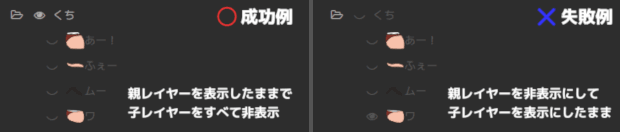

# エラーメッセージが表示される

拡張編集で新規プロジェクトを作成したときなどに

```
＊＊＊　エラーメッセージ　＊＊＊

failed to execute: script\PSDToolkit\PSDToolKit.exe
Failed to execute: 2

Please check whether the antivirus software is blocking program execution.
アンチウィルスソフトがプログラム実行を阻害していないか確認してください。
```

上記のようなメッセージが出る場合は、`script\PSDToolkit\PSDToolKit.exe` が何らかの理由でブロックされているのが原因です。  
AviUtl を `C:\AviUtl\aviutl.exe` あたりに置いて起動するか、試してみてください。

また、もしアンチウィルスソフトが警告を出す場合は、究極的には開発者を信じるかアンチウィルスソフトを信じるかの2択になります。

開発者を信用しない場合は自分でソースコードを元にプログラムをコンパイルして使用するか、使用自体を諦めてください。  
信用してもいい場合はアンチウィルスソフトで除外するなどの設定を行ってください。

# PSDToolKit ウィンドウがフリーズする

作者が実際に状況を確認したわけではないですが、アンチウィルスソフトによってはこのような症状が起こることもあるようです。

# 拡張編集にファイルが投げ込めない

拡張編集のタイムライン上にエクスプローラーから PSD ファイルなどをドラッグ＆ドロップで読み込もうとした時に、マウスカーソルが 🚫 になって投げ込めないことがあります。

これは大抵の場合 AviUtl が管理者権限など、特殊な権限で動作してしまっているのが原因です。  
エクスプローラーで `aviutl.exe` や `script\PSDToolKit\PSDToolKit.exe` のプロパティを開いて、管理者権限で実行するような設定が有効になってしまっていないか確認してください。

# レイヤーが消えない / 複数表示される / 指定していないレイヤーが出る

[ラジオボタン化](https://oov.github.io/psdtool/manual.html#original-feature-asterisk)されているレイヤーを操作している場合や[シンプルビュー](pfv.md#PSDToolKit_で_PSDTool_のお気に入りを読み込む)を使って設定している場合はグループ内で単独のパーツのみを正しく表示できますが、それらの機能に対応していない PSD ファイルでは、例えば口パクで口のパーツが複数同時に表示されたりすることがあります。

このようなときは、PSD ファイルのアイテムに **口を全て非表示にしたもの** を `送る` ボタンで割り当てておけば問題なく利用することができます。

## 非表示にする際の注意点



上記のようにパーツを束ねているフォルダーだけを非表示にしてしまうと、スライダーなどでパーツを切り替えても意図通りには表示されません。  

パーツを非表示にする際は個々のパーツのみを非表示にし、そのパーツが表示状態になった時に画面に出るように、親のフォルダーは全て表示状態にしておく必要があります。


# 設定が保存されない


拡張編集の `パラメータ設定` ダイアログは、**全ての設定値の合計**が255バイトを超えると上手く保存されなくなり、**後ろの方に書いた内容が消えてしまう**ようになります。

この255バイトには入力したテキストだけでなくスクリプトとして必要な文字も含まれており、実際にはもっと少ない文字数しか記述できません。

これは拡張編集における仕様であるため基本的に回避することができませんが、このダイアログを使わずに設定する [同じ階層のレイヤーをエクスポート](tutorial.md#*.anm_ファイルを作成する) ならこの制限を回避することができます。

## スクリプト制御で目パチを行う

`目パチ` や `口パク` のみを使いたいだけの場合は、`アニメーション効果` の代わりに `スクリプト制御` を使う方法もあり、これなら1024バイトまで入力することができます。

例えば[目パチ用フォーム](psd.md#目パチ_を_Lua_スクリプトから使う)で使いたい内容を組み立ててクリップボードにコピーし、

```lua
PSD:addstate(ここに組み立てた内容をペースト)
```

というスクリプトを記述すると、`目パチ` のアニメーション効果と全く同じように使うことができます。


# 項目名の一部が文字化けする

アニメーション効果に割り当てたりエクスポートした項目名で、

`v1.!%xQ情/!目/*にっこり`

のように、一部がおかしな文字になることがありますが、**これは正常な動作** です。

- 一部の記号が含まれている
- `Shift_JIS` では使えない文字が含まれている
- `ソ` / `十` / `表` / `能` といったいわゆる「ダメ文字」が含まれている

上記のいずれかに該当する場合に、トラブルを回避するためにそれらを使わない表現に変換しています。

# アニメーションの動きが変

AviUtl のプレビュー再生は描画が間に合わない時はコマ飛びし、コマ飛びによって動画の内容自体が変わってしまうこともあるためフレーム単位での正確な確認には向きません。

きちんと動作しているかを確認したい場合は動画ファイルへの書き出しや[`拡張編集RAMプレビュー`](plugins.md#拡張編集RAMプレビュー)を利用して、コマ飛びがない状態で確認してみてください。

# 口パクがほとんど開きっぱなしになる / ほとんど開かない

音声に対して `口パク準備` の設定が適切ではない場合、過剰に口が開きっぱなしになったり、ほとんど開かないなどという状況に陥ることがあります。

初期値は多くの場合に上手く母音が捉えられ小さい音声に対しても反応する設定になっていますが、対象が音声だけではないファイルだったり、ノイズが多いファイルなどの場合には設定を見直さなければ上手く動かないでしょう。

個別のファイルを調整する場合は `口パク準備` のスライダーを、全体に対して調整する場合は `PSD ファイルオブジェクト` 側にある `ls_locut`/`ls_hicut`/`ls_threshold`/`ls_sensitivity` を使用します。

# 口パクの動きが激しすぎる

[PSD ファイルオブジェクト](obj.md#PSD_ファイルオブジェクト) や [`口パク準備`](prep.md#口パク準備@PSDToolKit) にある `感度` パラメーターを使うと、動きのバタつきを抑えることができます。

ただし、この値を大きくすると反応が遅れ気味になるので、[`チャンネルストリップ`](audio.md#チャンネルストリップ) を使って音声に遅延を加えたり、[`環境設定ダイアログ`](setting.md#環境設定ダイアログ) で `口パク準備` の `オフセット` にマイナスの値を入れて、口パク準備が音声よりも若干手前に配置されるようにする必要があるかもしれません。

# 口パクを母音に合わせて動かしても違和感がある

母音の形に合わせてアニメーションをするのは比較的難しく、期待しているほど上手く動かないこともあります。

手間をいとわず細かい制御をしたい場合は [`*.lab` ファイルを直接拡張編集のタイムライン上に投げ込む](plugins.md#*.lab_ファイル) のがオススメです。  
この方法なら音素毎のタイミングも含めて手動で調整できるようになるので、後から微調整がタイムライン上で行なえます。

# 字幕のテキストを自動で加工したい

[`setting.lua` を作成](setting.md#設定のカスタマイズ)し、[`P:wav_subtitle_replacer`](setting.md#P:wav_subtitle_replacer) の設定を行うことで実現できます。

[かんしくん](forcepser.md)を使う場合は `modifier` を利用することでドロップ前に加工することもできます。

どちらの場合も Lua スクリプトの知識が必須です。

# 一部のアニメーション効果を使うと挙動がおかしい

別のレイヤーに配置された画像を必要とするアニメーション効果スクリプト（例：モーフィング）などは、`PSD ファイルオブジェクト` を指定しても上手く動かないことがあります。

このような現象が起きた時は、アニメーション効果で利用される `PSD ファイルオブジェクト` の [`scene` パラメーター](obj.md#PSD_ファイルオブジェクト)を 0 ではない値に変えてみてください。

# 多目的スライダーで指定したパーツが出ない / 反映が１フレーム遅れる

拡張編集では上のレイヤーに置かれたオブジェクトから順に処理されていきます。

そのため `PSD ファイルオブジェクト` や `字幕表示` より下のレイヤーに `口パク準備` / `多目的スライダー` / `字幕準備` などを置くと、`PSD ファイルオブジェクト` や `字幕表示` などで画面への描画が行われたあとで設定内容が反映されることになるため、結果的に１フレーム遅れて見えるようになります。

# 字幕準備を置いていないはずなのに一瞬だけ字幕が出る

`字幕表示` がない場所に `字幕準備` だけを置いているフレームがあると発生します。  
準備したデータを使わないまま残ってしまっているのが直接的な原因です。

これは **バグではなく仕様** です。

使われなかったデータを捨てるように Lua スクリプトを修正するのは簡単ですが、
その修正によって「説明書を読まずに `字幕表示` より下のレイヤーに `字幕準備` を置いて使う」という誤った使い方をしている全てのプロジェクトファイルが動作しなくなるため修正できません。

# 立ち絵に縁取りエフェクトが掛からない

AviUtl の最大画像サイズに達していると縁取りは期待通りに動作しません。  
(PSD ファイルであるかどうかは関係ありません)

`縁取り` の前に `クリッピング` で画像の周囲を予め削ってみてください。
