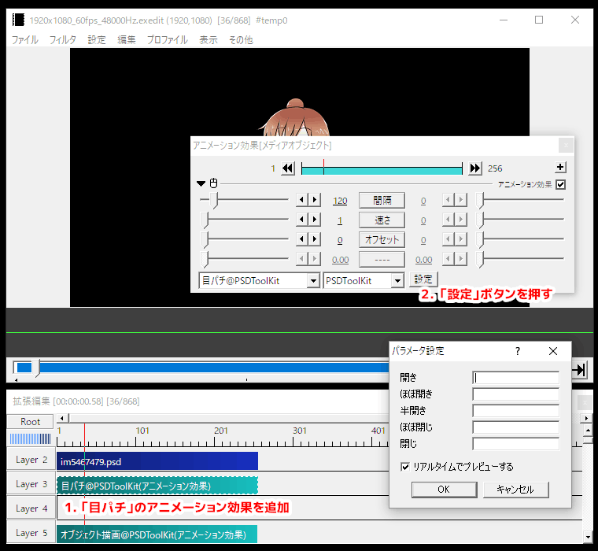
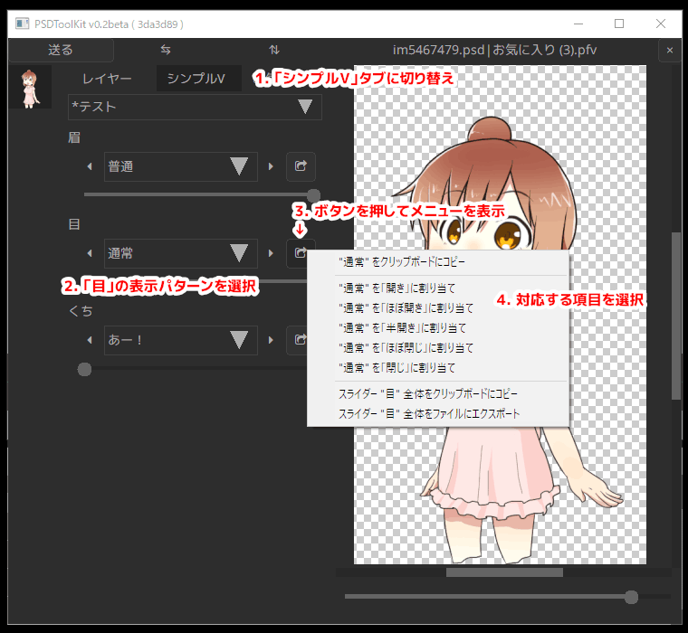
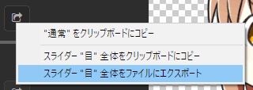
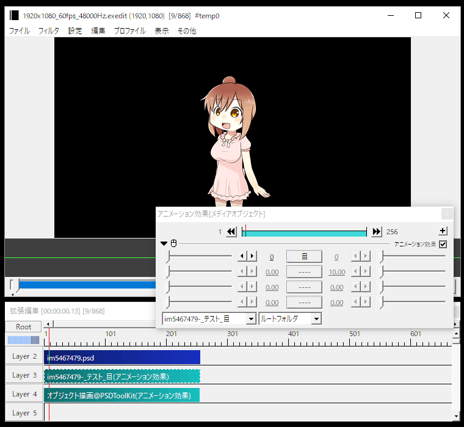
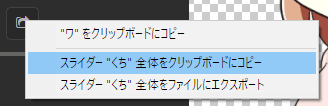
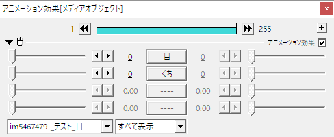

# PSDToolKit におけるシンプルビュー

PSDToolKit におけるシンプルビューは PSDTool 以上に大きな価値があり、動画の途中でパーツ単位での柔軟なレイヤーの切り替えなどを可能にします。

このドキュメントでは目パチ、口パク、パーツ差し替えなどの設定方法を解説していきます。

# オブジェクト描画について

高度な描画機能を利用する場合は `描画も行う` のチェックボックスを外し、代わりに `オブジェクト描画@PSDToolKit` の `アニメーション効果` を配置し、その間に描画処理を配置する必要があります。


1. **`描画も行う`のチェックを外す**  
すぐに描画せずに途中に処理を挟めるようにします。
2. **`オブジェクト描画`を配置**  
`アニメーション効果` の `オブジェクト描画@PSDToolKit` を配置し、最終的な描画処理をここで行います。
3. **必要な処理を配置する**  
この２つのオブジェクトの間に、様々な処理を挟み込みます。  

## ひとつのレイヤー内で行うには

`オブジェクト描画` を独立したレイヤーに配置する必要はないので、例えば以下のように全て `フィルタ効果` として追加しても、処理の順番さえあっていれば問題なく動作します。


# 目パチ（瞬き）を設定する

少なくとも「開いた目」と「閉じた目」の2種類以上のパターンがあれば、瞬きアニメーションを簡単に導入することができます。

以下の手順を始める前に PSDToolKit のウィンドウを表示しておいてください。



1. **`目パチ` のアニメーション効果を追加**  
拡張編集のタイムラインに `目パチ` のアニメーション効果を追加します。  
右クリックメニューの `メディアオブジェクトの追加`→`PSDToolKit`→`目パチ` で追加することができますが、自分でアニメーション効果を追加して設定しても構いません。  
必ず PSD ファイルを読み込んだオブジェクトと `オブジェクト描画` の間に挟み込むように配置します。
2. **`設定` ボタンを押す**  
設定ボタンを押すと `パラメータ設定` ダイアログが現れます。

この `パラメータ設定` ダイアログを開いた状態で、PSDToolKit ウィンドウ側を操作します。



1. **`シンプルV` タブに切り替え**  
まずはシンプルビューの画面に切り替えます。
2. **「目」の表示パターンを選択**  
開いた状態や閉じた状態など、割り当てたいパターンを選択します。
3. **ボタンを押してメニューを表示**  
パターンを割り当てるためにメニューを表示します。
4. **対応する項目を選択**  
閉じているパターンなら `"＊＊＊" を「閉じ」に割り当て` といったように、対応する項目を選んで割り当てます。  
なお、拡張編集側で `パラメータ設定` のウィンドウが出ていない時は割り当て用の項目は現れませんが、クリップボードにコピーしてから、あとで `パラメータ設定` ダイアログを開いて手動でペーストしても設定できます。

もし設定先を間違った場合は `パラメータ設定` ダイアログに入力されている内容を手動で削除してください。

以上の手順で必要なパターンを割り当てたら設定完了で、拡張編集側で確認するとアニメーションが行われます。

また、`目パチ` にはいくつかの設定項目があります。


プロパティ名|説明
---|---
`間隔(秒)`|次に瞬きを始めるまでの秒数です。
`速さ`|瞬きの速さをフレーム単位で指定します。
`オフセット`|瞬きを始めるタイミングをずらします。<br>複数キャラクターに `目パチ` を設定するとそのままでは同時に瞬きしてしまうので、必要に応じて `オフセット` で調整してください。

## 上手く `目パチ` が動かない時は

AviUtl のプレビュー再生は描画が間に合わない時はコマ飛びするようになっているので、きちんと動作しているかを確認したい場合は動画ファイルへ書き出しや[`拡張編集RAMプレビュー`](preview.md#拡張編集RAMプレビュー)を利用して、コマ飛びがない状態で確認してみてください。

`パラメータ設定` ダイアログで `OK` を押したにも関わらず設定内容がうまく保存されていないときは、[`パラメータ設定` ダイアログで設定が保存されないときは](#パラメータ設定_ダイアログで設定が保存されないときは)を参照してください。

## `目パチ` を Lua スクリプトから使う

以下のような Lua スクリプトを使うと、スクリプトから目パチを行えます。

```lua
-- 上から順に 閉じ から 開き へのパターンを入れておく
local patterns = {
  "S.お気に入り/*目パチ/目~閉じ",
  "S.お気に入り/*目パチ/目~ほぼ閉じ",
  "S.お気に入り/*目パチ/目~半目",
  "S.お気に入り/*目パチ/目~ほぼ開き",
  "S.お気に入り/*目パチ/目~開き"
}
local interval = 4 -- 間隔(秒)
local speed    = 1 -- 速さ
local offset   = 0 -- オフセット
local blinker = require("PSDToolKit").Blinker.new(patterns, interval, speed, offset) -- 目パチオブジェクトを生成

PSD:addstate(blinker) -- 生成したオブジェクトをグローバル変数 PSD に割り当てる
```

以下のフォームを使うと、上記のコードで生成する目パチオブジェクトと同等のものを自動生成できます。

<form id="blinker-builder" class="ptk-script-builder">
<dl>
<dt>開き</dt><dd><input type="text" name="m4" autocomplete="off" placeholder="例: S.お気に入り/*目パチ/目~開き"></dd>
<dt>ほぼ開き</dt><dd><input type="text" name="m3" autocomplete="off" placeholder="例: S.お気に入り/*目パチ/目~ほぼ開き"></dd>
<dt>半開き</dt><dd><input type="text" name="m2" autocomplete="off" placeholder="例: S.お気に入り/*目パチ/目~半開き"></dd>
<dt>ほぼ閉じ</dt><dd><input type="text" name="m1" autocomplete="off" placeholder="例: S.お気に入り/*目パチ/目~ほぼ閉じ"></dd>
<dt>閉じ</dt><dd><input type="text" name="m0" autocomplete="off" placeholder="例: S.お気に入り/*目パチ/目~閉じ"></dd>
</dl>
<dl>
<dt>間隔(秒)</dt><dd><input type="text" name="interval" autocomplete="off" value="4" placeholder="例: 4"></dd>
<dt>速さ</dt><dd><input type="text" name="speed" autocomplete="off" value="1" placeholder="例: 1"></dd>
<dt>オフセット</dt><dd><input type="text" name="offset" autocomplete="off" value="0" placeholder="例: 0"></dd>
</dl>
<dl>
<dt>出力</dt><dd><input type="text" name="output" value="" readonly="readonly"></dd><dd><button type="button" name="copy">クリップボードにコピー</button></dd>
</dl>
</form>

# 口パク（リップシンク）を設定する

口パクの設定をする場合はアニメーションの基準になる `口パク準備` が必要になりますが、拡張編集のタイムラインへの `口パク準備` の配置は[音声に合わせた口パク（リップシンク）](audio.md#音声に合わせた口パク（リップシンク）)の項で詳しく解説しているため、ここでは割愛します。

## 口パク 開閉のみ

開閉のみのアニメーションを行う `口パク 開閉のみ` は、`目パチ` とほぼ同じ要領で設定できます。


1. **`口パク 開閉のみ` のアニメーション効果を追加**  
拡張編集のタイムラインに `口パク 開閉のみ` のアニメーション効果を追加します。  
右クリックメニューの `メディアオブジェクトの追加`→`PSDToolKit`→`口パク　開閉のみ` で追加することができますが、自分でアニメーション効果を追加して設定しても構いません。  
必ず PSD ファイルを読み込んだオブジェクトと `オブジェクト描画` の間に挟み込むように配置します。
2. **`設定` ボタンを押して表情パターンを割り当て**  
設定方法は `目パチ` と全く同じですので詳細は割愛します。
3. **`口パク準備` にレイヤー番号を指定**  
アニメーションの基準になる `口パク準備` が配置されているレイヤー番号を `口パク準備` の項目に指定します。  
このスクリーンショットでは `Layer 1` に配置されているので `1` を指定します。

以上の設定を行うことで、音声内容に合わせてアニメーションするようになります。

また、`口パク 開閉のみ` にはいくつかの設定項目があります。


プロパティ名|説明
---|---
`速さ`|口パクの速さをフレーム単位で指定します。
`口パク準備`|アニメーションの基準になる `口パク準備` が配置されているレイヤー番号を指定します。
`口パク準備がなくても有効`|チェックを入れると、`口パク準備` のオブジェクトがない区間でも `閉じ` のパターンが適用されるようになります。

### 上手く `口パク 開閉のみ` が動かない時は

AviUtl のプレビュー再生は描画が間に合わない時はコマ飛びするようになっているので、きちんと動作しているかを確認したい場合は動画ファイルへ書き出しや[`拡張編集RAMプレビュー`](preview.md#拡張編集RAMプレビュー)を利用して、コマ飛びがない状態で確認してみてください。

また、音声に対して `口パク準備` の設定が適切ではない場合、過剰に口が開きっぱなしになったり、ほとんど開かないなどという状況に陥ることがあります。  
初期値は多くの場合に上手く母音が捉えられ小さい音声に対しても反応する設定になっていますが、対象が音声だけではないファイルだったり、ノイズが多いファイルなどの場合には設定を見直さなければ上手く動かないでしょう。

既にタイムラインに設置済みの複数の `口パク準備` の設定を[一括で変更する方法もあります](audio.md#自動作成される_口パク準備_のパラメーターの初期設定を変更する)。

`パラメータ設定` ダイアログで `OK` を押したにも関わらず設定内容がうまく保存されていないときは、[`パラメータ設定` ダイアログで設定が保存されないときは](#パラメータ設定_ダイアログで設定が保存されないときは)を参照してください。

### `口パク 開閉のみ` を Lua スクリプトから使う

以下のような Lua スクリプトを使うと、スクリプトから口パクを行えます。

```lua
-- 上から順に 閉じ から 開き へのパターンを入れておく
local patterns = {
  "S.お気に入り/*口パク/口~閉じ",
  "S.お気に入り/*口パク/口~ほぼ閉じ",
  "S.お気に入り/*口パク/口~半開き",
  "S.お気に入り/*口パク/口~ほぼ開き",
  "S.お気に入り/*口パク/口~開き"
}
local speed = 1 -- 速さ
local layerindex = 1 -- 口パク準備
local alwaysapply = true -- 口パク準備がなくても有効
local lipsync = require("PSDToolKit").LipSyncSimple.new(patterns, speed, layerindex, alwaysapply) -- 口パクオブジェクトを生成

PSD:addstate(lipsync) -- 生成したオブジェクトをグローバル変数 PSD に割り当てる
```

以下のフォームを使うと、上記のコードで生成する口パクオブジェクトと同等のものを自動生成できます。

<form id="lipsyncsimple-builder" class="ptk-script-builder">
<dl>
<dt>開き</dt><dd><input type="text" name="m4" autocomplete="off" placeholder="例: S.お気に入り/*口パク/口~開き"></dd>
<dt>ほぼ開き</dt><dd><input type="text" name="m3" autocomplete="off" placeholder="例: S.お気に入り/*口パク/口~ほぼ開き"></dd>
<dt>半開き</dt><dd><input type="text" name="m2" autocomplete="off" placeholder="例: S.お気に入り/*口パク/口~半開き"></dd>
<dt>ほぼ閉じ</dt><dd><input type="text" name="m1" autocomplete="off" placeholder="例: S.お気に入り/*口パク/口~ほぼ閉じ"></dd>
<dt>閉じ</dt><dd><input type="text" name="m0" autocomplete="off" placeholder="例: S.お気に入り/*口パク/口~閉じ"></dd>
</dl>
<dl>
<dt>速さ</dt><dd><input type="text" name="speed" autocomplete="off" value="1" placeholder="例: 1"></dd>
<dt>口パク準備</dt><dd><input type="text" name="layerindex" autocomplete="off" value="1" placeholder="例: 1"></dd>
<dt>オプション</dt><dd><label><input type="checkbox" name="alwaysapply" autocomplete="off" value="1" checked="checked">口パク準備がなくても有効</label></dd>
</dl>
<dl>
<dt>出力</dt><dd><input type="text" name="output" value="" readonly="readonly"></dd><dd><button type="button" name="copy">クリップボードにコピー</button></dd>
</dl>
</form>

## 口パク あいうえお

`口パク あいうえお` は母音の形に合わせてアニメーションを行うタイプのアニメーションで、`あ`/`い`/`う`/`え`/`お`/`ん` に対応した表情パターンが必要になります。

また音声ファイルから自動で母音を認識するような機能は PSDToolKit にはないため、`口パク準備` を使う際に `*.wav` ファイルと同名の `*.lab` ファイルを用意するか、拡張編集のタイムラインへ直接 `*.lab` ファイルをドラッグ＆ドロップして母音のタイミング情報を認識できる状態にする必要があります。

設定方法自体は `口パク 開閉のみ` と同じなのでここでは割愛します。

`口パク あいうえお` には以下の設定項目があります。


プロパティ名|説明
---|---
`子音処理`|子音の処理方法を指定します。<br>`0` - すべて「ん」として処理する<br>`1` - 口を閉じる子音（ま・ぱ・ば・ヴ行）以外は前後の母音の形を引き継ぐ<br>`2` - 口を閉じる子音以外は前後の母音の形をより小さいもので補間
`口パク準備`|アニメーションの基準になる `口パク準備` が配置されているレイヤー番号を指定します。
`口パク準備がなくても有効`|チェックを入れると、`口パク準備` のオブジェクトがない区間でも `閉じ` のパターンが適用されるようになります。

### 上手く `口パク あいうえお` が動かない時は

AviUtl のプレビュー再生は描画が間に合わない時はコマ飛びするようになっているので、きちんと動作しているかを確認したい場合は動画ファイルへ書き出しや[`拡張編集RAMプレビュー`](preview.md#拡張編集RAMプレビュー)を利用して、コマ飛びがない状態で確認してみてください。

また、母音の形に合わせてアニメーションをするのは比較的難しく、期待しているほど上手く動かないこともあります。

細かい制御をしたい場合は [`*.lab` ファイルを直接拡張編集のタイムライン上に投げ込む](audio.md#*.lab_ファイルのもうひとつの使い方) のがオススメです。  
この方法なら音素毎のタイミングも含めて手動で調整できるようになるので、後から微調整がタイムライン上で行なえます。

`パラメータ設定` ダイアログで `OK` を押したにも関わらず設定内容がうまく保存されていないときは、[`パラメータ設定` ダイアログで設定が保存されないときは](#パラメータ設定_ダイアログで設定が保存されないときは)を参照してください。

### `口パク あいうえお` を Lua スクリプトから使う

以下のような Lua スクリプトを使うと、スクリプトから口パクを行えます。

```lua
-- あ/い/う/え/お/ん に相当するパターンを割り当てる
local patterns = {
  a = "S.お気に入り/*口パク/口~あ",
  i = "S.お気に入り/*口パク/口~い",
  u = "S.お気に入り/*口パク/口~う",
  e = "S.お気に入り/*口パク/口~え",
  o = "S.お気に入り/*口パク/口~お",
  N = "S.お気に入り/*口パク/口~ん"
}
local mode = 0 -- 子音処理
local layerindex = 1 -- 口パク準備
local alwaysapply = true -- 口パク準備がなくても有効
local lipsync = require("PSDToolKit").LipSyncLab.new(patterns, mode, layerindex, alwaysapply) -- 口パクオブジェクトを生成

PSD:addstate(lipsync) -- 生成したオブジェクトをグローバル変数 PSD に割り当てる
```

以下のフォームを使うと、上記のコードで生成する口パクオブジェクトと同等のものを自動生成できます。

<form id="lipsynclab-builder" class="ptk-script-builder">
<dl>
<dt>あ</dt><dd><input type="text" name="a" autocomplete="off" placeholder="例: S.お気に入り/*口パク/口~あ"></dd>
<dt>い</dt><dd><input type="text" name="i" autocomplete="off" placeholder="例: S.お気に入り/*口パク/口~い"></dd>
<dt>う</dt><dd><input type="text" name="u" autocomplete="off" placeholder="例: S.お気に入り/*口パク/口~う"></dd>
<dt>え</dt><dd><input type="text" name="e" autocomplete="off" placeholder="例: S.お気に入り/*口パク/口~え"></dd>
<dt>お</dt><dd><input type="text" name="o" autocomplete="off" placeholder="例: S.お気に入り/*口パク/口~お"></dd>
<dt>ん</dt><dd><input type="text" name="N" autocomplete="off" placeholder="例: S.お気に入り/*口パク/口~ん"></dd>
</dl>
<dl>
<dt>子音処理</dt><dd><input type="text" name="mode" autocomplete="off" value="0" placeholder="例: 0"></dd>
<dt>口パク準備</dt><dd><input type="text" name="layerindex" autocomplete="off" value="1" placeholder="例: 1"></dd>
<dt>オプション</dt><dd><label><input type="checkbox" name="alwaysapply" autocomplete="off" value="1" checked="checked">口パク準備がなくても有効</label></dd>
</dl>
<dl>
<dt>出力</dt><dd><input type="text" name="output" value="" readonly="readonly"></dd><dd><button type="button" name="copy">クリップボードにコピー</button></dd>
</dl>
</form>

### もっと柔軟に Lua スクリプトから制御する

`口パク あいうえお` を使わずに自分でスクリプトを書くことももちろんできます。  
このアプローチなら思いのままに動かせるでしょう。

以下はスクリプトの記述例です。

```lua
-- このスクリプトを「口パク　あいうえお」の代わりに挿入することで、
-- 自前の口パク処理を実装できます
-- （例えば「スクリプト制御」を追加して dofile('script\\lipsync_example.lua') など）

-- 口パク準備があるレイヤー番号
local layerindex = 1

-- それぞれの音素に対応した口の形
-- 必要に応じて好きな子音のパターンの追加もできます
local patterns = {
  a = "S.お気に入り/*口パク用/口~あ",
  i = "S.お気に入り/*口パク用/口~い",
  u = "S.お気に入り/*口パク用/口~う",
  e = "S.お気に入り/*口パク用/口~え",
  o = "S.お気に入り/*口パク用/口~お",
  N = "S.お気に入り/*口パク用/口~ん"
}

-- ちなみに CeVIO で使われる音素は以下のようなものですが、
-- lab ファイルを書き出すソフトによっては方言があるかもしれません
--   pau
--     無音部分
--   cl
--     「っ」
--   a/i/u/e/o
--     母音
--   A/I/U/E/O
--     無声化された母音
--     ※例「洗濯機」→「s/e/N/t/a/k/U/k/i」
--   N
--     「ん」
--   k/s/t/n/h/m/y/r/w/g/z/d/b/p
--   ky/sh/ch/ny/hy/my/ry/gy/j/by/py
--     子音

-- 無声化された母音は通常の母音を使いまわす
patterns.A = patterns.A or patterns.a or nil
patterns.I = patterns.I or patterns.i or nil
patterns.U = patterns.U or patterns.u or nil
patterns.E = patterns.E or patterns.e or nil
patterns.O = patterns.O or patterns.o or nil
-- pau は N を割り当て
patterns.pau = patterns.pau or patterns.N or nil

-- 指定されたレイヤー番号から音量と音素情報を取得
local ts = require('PSDToolKit').talk:get(layerindex)
-- ts には以下のプロパティがあります
-- boolean ts.used       「口パク 開閉のみ」や「口パク あいうえお」で処理済みかどうか
-- number  ts.frame      「口パク準備」基準でのフレーム数
-- number  ts.time       「口パク準備」基準での時間（秒）
-- number  ts.totalframe 「口パク準備」基準での総フレーム数
-- number  ts.totaltime  「口パク準備」基準での総時間（秒）
-- number  ts.volume     「口パク準備」の「しきい値」を 1.0 とした時の音量
-- number  ts.threshold  「口パク準備」の「しきい値」
-- number  ts.progress   現在の音素の開始地点を0、終了地点を1とした時の現在位置
-- string  ts.cur        発音中の音素（ない時は空文字列）
-- number  ts.cur_start  音素が始まる時間（ない時は0）
-- number  ts.cur_end    音素が終わる時間（ない時は0）
-- string  ts.prev       前の音素（ない時は空文字列）
-- number  ts.prev_start 音素が始まる時間（ない時は0）
-- number  ts.prev_end   音素が終わる時間（ない時は0）
-- string  ts.next       次の音素（ない時は空文字列）
-- number  ts.next_start 音素が始まる時間（ない時は0）
-- number  ts.next_end   音素が終わる時間（ない時は0）
-- ts には以下のメソッドがあります
-- boolean ts:curisvowel() 現在発音中の音素が母音の時に 1、無声化された母音の時に -1、それ以外の時に 0
-- boolean ts:previsvowel() 前の音素が母音の時に 1、無声化された母音の時に -1、それ以外の時に 0
-- boolean ts:nextisvowel() 次の音素が母音の時に 1、無声化された母音の時に -1、それ以外の時に 0
-- ただし未設定の場合など、ts が正しく取得できない場合は nil です
-- また *.lab ファイルのタイムラインへのドラッグ＆ドロップにより音素情報を直接タイムライン上に持っている場合は
-- ts.prev や ts.next などのプロパティにはデータが入りません

if ts == nil or ts.used then
  -- 音素情報が取得できなかった時は「ん」のパターンを割り当て
  -- PSD:addstate を使うと現在のPSDファイルのレイヤー表示に対して状態を追記できます
  PSD:addstate(patterns.N)
else
  ts.used = true
  -- この音素用のパターンが設定されている場合はそれを使う
  if patterns[ts.cur] ~= nil and patterns[ts.cur] ~= "" then
    PSD:addstate(patterns[ts.cur])
  else
    -- 音素用のパターンが見つからなかった場合は
    -- 前の母音をそのまま引き継いでみる
    if ts.prev_end == ts.cur_start and ts:previsvowel() ~= 0 then
      PSD:addstate(patterns[ts.prev])
    else
      -- 上手く引き継げない時は「ん」でお茶を濁す
      PSD:addstate(patterns.N)
    end
  end
end
```

# パーツ差し替え

`パーツ差し替え` は拡張編集上のスライダーでシンプルビューのパターンを切り替えるようにする `アニメーション効果` です。

これを使うと編集中に PSDToolKit ウィンドウを使う頻度が減るため、作業効率が向上します。

設定方法は目パチと同じで、設定項目も目的のスライダー以外はないため大変シンプルです。

ただし拡張編集の `パラメータ設定` ダイアログには文字数上限や項目数上限があるため、多数のパーツを一気に指定する用途には向きません。

たくさんの項目から選びたい場合は[スライダーのエクスポート](#スライダーのエクスポート)の利用を検討してください。


プロパティ名|説明
---|---
`パーツ`|設定したパーツのどれを使うかを選択するスライダーです。<br>`0` - パーツを使用しない<br>`1`～`16` - 選択したパーツを使用する

## 上手く `パーツ差し替え` が動かないときは

`パラメータ設定` ダイアログで `OK` を押したにも関わらず設定内容がうまく保存されていないときは、[`パラメータ設定` ダイアログで設定が保存されないときは](#パラメータ設定_ダイアログで設定が保存されないときは)を参照してください。

# スライダーのエクスポート

PSDToolKit のシンプルビューは、拡張編集の `アニメーション効果` として使うためにエクスポートすることができます。



メニューを選択すると `名前を付けて保存` のダイアログが表示されるので、AviUtl の `script` フォルダー内に保存してください。  
また、エクスポートしたファイルは AviUtl を再起動するまでは認識されないため、作業中のプロジェクトも保存した上で AviUtl を再起動してください。



エクスポートしたスライダーをアニメーション効果で選択すれば、スライダーでパーツの切り替えが行えるようになります。  
スライダーの値の `0` は `パーツ切り替え` のアニメーション効果と同じく「パーツを使用しない」状態で、`1` 以降で実際にパーツが選択された状態になります。

## エクスポートしたスライダーの改良

エクスポートしたままの状態で使っても便利ですが、このスクリプトファイルを編集するともっと便利になります。

エクスポートしたファイルをメモ帳などのテキストエディタで開くと、概ね以下のような内容になっています。

```lua
--track0:目,0,4,0,1
local values = {
  "S.お気に入り/*テスト/目~つぶり",
  "S.お気に入り/*テスト/目~ぐるぐる",
  "S.お気に入り/*テスト/目~にっこり",
  "S.お気に入り/*テスト/目~通常"
}
PSD:addstate(values[obj.track0])
```

まず、1行目にある `--track0:目,0,4,0,1` はそれぞれ `--track0:項目名,最小値,最大値,初期値,移動量` という役割になっており、上の例では項目が全部で４つあるため最大値が `4` になっており、もし選択できる項目をひとつ増やす場合は `5` に書き換える必要があります。

そして先頭にある `track0` というのが重要で、拡張編集では縦に並んだスライダーのそれぞれに `track0`/`track1`/`track2`/`track3` という名前を付けています。


そのため、まず他のスライダー全体をクリップボードにコピーし、



さっきのテキストの下に貼り付けて、

```lua
--track0:目,0,4,0,1
local values = {
  "S.お気に入り/*テスト/目~つぶり",
  "S.お気に入り/*テスト/目~ぐるぐる",
  "S.お気に入り/*テスト/目~にっこり",
  "S.お気に入り/*テスト/目~通常"
}
PSD:addstate(values[obj.track0])

--track0:くち,0,4,0,1
local values = {
  "S.お気に入り/*テスト/くち~あー！",
  "S.お気に入り/*テスト/くち~ふぇー",
  "S.お気に入り/*テスト/くち~ムー",
  "S.お気に入り/*テスト/くち~ワ"
}
PSD:addstate(values[obj.track0])
```

貼り付けた分の `track0` を `track1` に書き換えて（2箇所）、

```lua
--track0:目,0,4,0,1
local values = {
  "S.お気に入り/*テスト/目~つぶり",
  "S.お気に入り/*テスト/目~ぐるぐる",
  "S.お気に入り/*テスト/目~にっこり",
  "S.お気に入り/*テスト/目~通常"
}
PSD:addstate(values[obj.track0])

--track1:くち,0,4,0,1
local values = {
  "S.お気に入り/*テスト/くち~あー！",
  "S.お気に入り/*テスト/くち~ふぇー",
  "S.お気に入り/*テスト/くち~ムー",
  "S.お気に入り/*テスト/くち~ワ"
}
PSD:addstate(values[obj.track1])
```

最後に `--track1` の行を上でまとめれば、

```lua
--track0:目,0,4,0,1
--track1:くち,0,4,0,1
local values = {
  "S.お気に入り/*テスト/目~つぶり",
  "S.お気に入り/*テスト/目~ぐるぐる",
  "S.お気に入り/*テスト/目~にっこり",
  "S.お気に入り/*テスト/目~通常"
}
PSD:addstate(values[obj.track0])

local values = {
  "S.お気に入り/*テスト/くち~あー！",
  "S.お気に入り/*テスト/くち~ふぇー",
  "S.お気に入り/*テスト/くち~ムー",
  "S.お気に入り/*テスト/くち~ワ"
}
PSD:addstate(values[obj.track1])
```

2つのスライダーが使えるようになります。  
（`*.anm` ファイルの変更を反映させるために AviUtl の再起動が必要です）



これを繰り返せば、4つのスライダーに別々のパーツを割り当てることができます。

## スライダーに目パチを割り当てる

スライダーの値の一つとして、アニメーションする項目を割り当てることもできます。

```lua
--track0:目,0,5,0,1
local values = {
  require("PSDToolKit").Blinker.new({"S.お気に入り/*テスト/目~つぶり","S.お気に入り/*テスト/目~通常"},4,3,0),
  "S.お気に入り/*テスト/目~つぶり",
  "S.お気に入り/*テスト/目~ぐるぐる",
  "S.お気に入り/*テスト/目~にっこり",
  "S.お気に入り/*テスト/目~通常"
}
PSD:addstate(values[obj.track0])
```

元々存在していない項目を先頭に追加しているので、`--track0` の行にあるスライダーの最大値も `5` に書き換えています。

このようにすれば、スライダーを `1` にした時は「間隔(秒) 4 / 速さ 3 / オフセット 0」に設定した目パチとして動作し、それ以外は目の切り替えとして機能します。

また、この目パチ用の項目は [目パチ を Lua スクリプトから使う](#目パチ_を_Lua_スクリプトから使う) にある入力用フォームを使えば簡単に作ることができます。  
もちろん口パクに関しても入力用フォームを使うことで、同じように簡単に組み立てることができます。

## スライダーに口パクを割り当てる

目パチと同じように口パク系ももちろん登録できますが、口パクは同じやり方でやると `口パク準備` の指定を編集中に変更したりできず不便になるので、もう少し工夫するのがオススメです。


このように `アニメーション効果` の前に `スクリプト制御` を挿入し `layer = 1` として `口パク準備` の位置を指定しておいて、

```lua
--track0:くち,0,5,0,1
local values = {
  require("PSDToolKit").LipSyncSimple.new({"S.お気に入り/*テスト/くち~ムー","S.お気に入り/*テスト/くち~ワ"},3,layer,true),
  "S.お気に入り/*テスト/くち~あー！",
  "S.お気に入り/*テスト/くち~ふぇー",
  "S.お気に入り/*テスト/くち~ムー",
  "S.お気に入り/*テスト/くち~ワ"
}
PSD:addstate(values[obj.track0])
```

アニメーション効果のスクリプト内では `layer` の値を参照するようにすれば、必要なタイミングで `layer = 1` の部分を書き換えるだけで `口パク準備` の指定を変更できるようになります。

もちろん `口パク準備` 以外のパラメーターも外部から指定できるようにしても便利ですし、`LipSyncSimple` を作成するコード自体をスクリプト制御側に移動すれば、煩雑になる代わりに柔軟に対応できるようになります。

# 項目名の一部が文字化けしている？

アニメーション効果に割り当てたりエクスポートした項目名が、

`S.お気に入り/*テスト/目~通常`

のようなものではなく、

`S.お気に入り/*%xQ情/目~通常`

のように、一部がおかしな文字になることがあります。

これはランダムに発生するわけではなくきちんと理由があり、

- `Shift_JIS` では使えない文字が含まれている
- `ソ` / `十` / `表` / `能` といったいわゆる「ダメ文字」が含まれている

のいずれかに該当する場合に、トラブルを回避するためにそれらを使わない表現に変換しています。

# `パラメータ設定` ダイアログで設定が保存されないときは


AviUtl の `パラメータ設定` ダイアログは、**全ての設定値の合計**が255バイトを超えると上手く保存されなくなってしまいます。

これを回避するためにはテキストを短くする以外に選択肢がありません。

お気に入りに登録しているフォルダーの名前を短くしたりして、設定に書き込むテキストを短くしてみてください。

なお、このダイアログを使わずに設定する [スライダーのエクスポート](#スライダーのエクスポート) を使うと、この制限を回避することができます。
