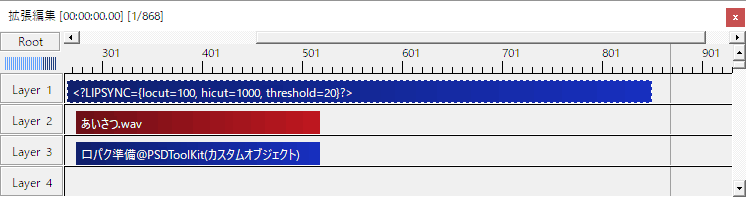

# ドラッグ＆ドロップ拡張について

PSDToolKit では[ごちゃまぜドロップス](https://github.com/oov/aviutl_gcmzdrops)を使用したドラッグ＆ドロップ拡張を行っており、一部のファイルを拡張編集のタイムラインにドラッグ＆ドロップした時の挙動が強化されています。

# `*.psd` ファイル

自動的に PSD ファイルを読み込んだ状態のオブジェクトを生成し、PSDToolKit ウィンドウの「ファイル切り替えタブ」にそのファイルを追加します。

# `*.wav` ファイル

`Shift キー` を押しながらファイルを投げ込むと、以下の追加処理が発動します。  
なお発動方法は [`P.wav_firemode`](setting.md#P.wav_firemode) で変更も可能です。

1. **口パク準備の自動生成**  
`*.wav` ファイルと同じ範囲に [`口パク準備`](psd2.md#口パク準備) を自動生成します。  
[`P.wav_lipsync`](setting.md#P.wav_lipsync) で自動生成しないように変更もできます。
2. **多目的スライダーの自動生成**  
`*.wav` ファイルと同じ範囲に [`多目的スライダー`](psd2.md#多目的スライダー) を自動生成します。  
ただしデフォルト設定では生成されず、[`P.wav_mpslider`](setting.md#P.wav_mpslider) の設定を変更すると生成されるようになります。
3. **字幕準備の自動生成**  
同じ名前の `*.txt` ファイル（つまり `こんにちは.wav` に対して `こんにちは.txt`）があると、`*.wav` ファイルと同じ範囲に [`字幕準備`](subtitle.md#字幕準備) を自動生成します。  
[`P.wav_insertmode`](setting.md#P.wav_insertmode) でただの `テキスト` を変更したり、生成しないように変更もできます。  
標準設定ではテキストファイルの文字エンコーディングは `Shift_JIS` であるものとして処理しますが、[`P.wav_subtitleencoding`](setting.md#P.wav_subtitleencoding) で `UTF-8` にも変更可能です。  
`*.txt` ファイルを一緒に掴んでドラッグ＆ドロップする必要はありません。

## Shift キーの押し方

ドラッグ＆ドロップの際、ファイルを掴む前から Shift キーを押してしまうと Windows のエクスプローラーなどでの挙動が変わってしまい、想定通りのファイルが上手くつかめないことがあります。


1. **Shift キーを押さずにファイルを掴む**  
まずは Shift キーを押さずに普通にファイルを掴みます。
2. **Shift キーを押しっぱなしにする**  
ファイルを掴んだまま、Shift キーを押しっぱなしにします。
3. **Shift キーを押したままでファイルを離す**  
Shift キーを押したままで、拡張編集へファイルを投げ込みます。
4. **Shift キーを離す**  
ドロップが完了した時点で Shift キーは離して構いません。

## 自動作成される `口パク準備` のパラメーターの初期設定を変更する

ドロップ時に自動的に作成される `口パク準備` は、`ローカット`/`ハイカット`/`しきい値`が初期設定のままになっています。

これを変更するためには個々の `口パク準備` のパラメーターを書き換えるような方法でももちろん対応可能ですが、このようなケースに対応するための仕組みが用意されています。

```
<?LIPSYNC={locut=100, hicut=1000, threshold=20}?>
```



このような `テキスト` オブジェクトを口パク準備より上のレイヤーに置いておくと、個々の設定を書き換えなくても一括で設定値を上書きできます。

# `*.lab` ファイル

音素が設定された特殊な `口パク準備` を生成します。


個々の音素を書き換えたり長さや位置の変更なども拡張編集上で行えるため、必要に応じて微調整が可能です。

ここに挿入されたデータは `口パク準備` と同じようにアニメーションなどの用途で利用可能ですが、以下のような細かな違いもあります。

- **現在地点の前後の音素情報が参照できない**  
`口パク準備` で `*.lab` ファイルを読んでいる時は参照できますが、この方法だと前後の音素は参照できません。
- **`*.wav` ファイルの音量が取得できない**  
この方法では `*.wav` ファイルは一切参照していないため、音量データへのアクセスはできません。

# `*.srt` ファイル

時間を合わせた複数の `字幕準備` を一括で生成します。
