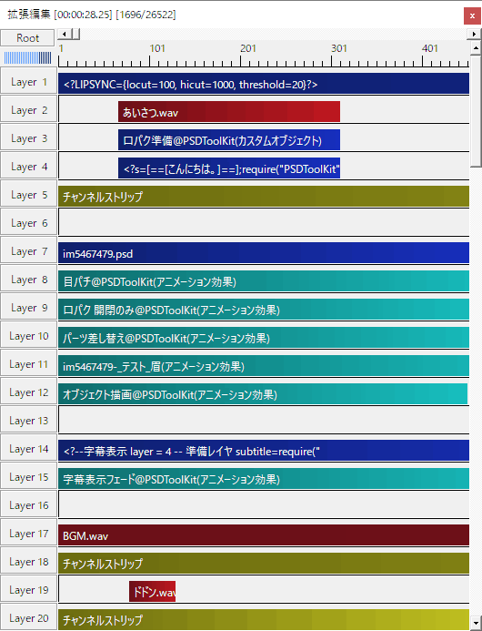

# 対象とする読者について

PSDToolKit は AviUtl 及び拡張編集に対して機能を追加するツールキットであるため、このドキュメントでは AviUtl 及び拡張編集の扱い方をある程度把握している人を対象に記述されています。

# ドキュメント早見表

PSDToolKit を活用すると、概ねこのような機能を使えるようになります。  
（説明のため一部は少し冗長な設置方法になっています）

レイヤー|説明
---|---
Layer 1|[口パク準備の設定値を上書き](audio.md#自動作成される_口パク準備_のパラメーターの初期設定を変更する)しています。
Layer 2|音声ファイルと口パク準備と字幕準備を[一回のドラッグ＆ドロップで配置](audio.md#字幕準備の使い方)しています。 `口パク準備` と `字幕準備` で準備されたデータを使う際は `準備レイヤ` の指定が必要になるので、上の方に配置すると後でレイヤー位置の変更が必要になることが少なく便利です。
Layer 3|口パク用データを準備するための [`口パク準備`](audio.md#音声に合わせた口パク（リップシンク）) オブジェクトです。
Layer 4|字幕用データを準備するための [`字幕準備`](audio.md#音声に合わせた字幕表示) オブジェクトです。
Layer 5|音声の音量などを調整するための [`チャンネルストリップ`](audio.md#チャンネルストリップ) です。
Layer 6|整理用の余白です。
Layer 7|[`PSD ファイルを読み込んだオブジェクト`](psd.md#PSD_ファイルの読み込み)です。
Layer 8|瞬きを行うための [`目パチ`](faview.md#目パチ（瞬き）を設定する) という `アニメーション効果` です。
Layer 9|リップシンクを行うための [`口パク 開閉のみ`](faview.md#口パク_開閉のみ) という `アニメーション効果` です。
Layer 10|表情などを拡張編集のスライダーで変更するための [`パーツ差し替え`](faview.md#パーツ差し替え) という `アニメーション効果` です。
Layer 11|表情などをより柔軟に変更するために[スライダーのエクスポート](faview.md#スライダーのエクスポート)を行った `アニメーション効果` です。 スライダーの中には[目パチなどのアニメーションを割り当てる](faview.md#スライダーに目パチを割り当てる)こともできます。
Layer 12|高度な描画機能を利用するために必要な [`オブジェクト描画`](faview.md#オブジェクト描画について) です。
Layer 13|余白、いいよね。
Layer 14|字幕を表示するための [`字幕表示`](audio.md#字幕準備で設定された字幕を表示する) です。
Layer 15|字幕でテキストアニメーションを行う [`字幕表示フェード`](audio.md#字幕表示_でのアニメーション効果) です。
Layer 16|聞かなくてもわかるね、余白です。
Layer 17|BGM のオーディオファイルです。
Layer 18|BGM を調整するための [`チャンネルストリップ`](audio.md#チャンネルストリップ) です。
Layer 19|定番の効果音、ドドンを自作しました。
Layer 20|効果音を調整するための [`チャンネルストリップ`](audio.md#チャンネルストリップ) です。