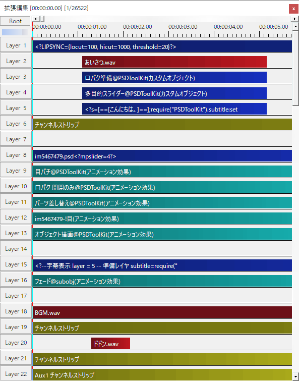

# 対象とする読者について

PSDToolKit は AviUtl 及び拡張編集に対して機能を追加するツールキットであるため、このドキュメントでは AviUtl 及び拡張編集の扱い方をある程度把握している人を対象に記述されています。

# ドキュメント早見表

PSDToolKit を活用すると、概ねこのような機能を使えるようになります。  
（説明のため一部は少し冗長な設置方法になっています）

レイヤー|説明
---|---
Layer  1|[口パク準備の設定値を上書き](gcmzdrops.md#自動作成される_口パク準備_のパラメーターの初期設定を変更する)しています。
Layer  2|音声ファイルと口パク準備と多目的スライダーと字幕準備を[一回のドラッグ＆ドロップで配置](gcmzdrops.md#*.wav_ファイル)しています。 `口パク準備` / `多目的スライダー` / `字幕準備` で準備されたデータを使う際は配置したレイヤー番号を指定する必要があるため、上の方に配置すると後でレイヤー位置の変更が必要になることが少なく便利です。
Layer  3|口パク用データを準備するための [`口パク準備`](psd2.md#口パク準備) オブジェクトです。
Layer  4|画像のレイヤー構成をコントロールするための [`多目的スライダー`](psd2.md#多目的スライダー) オブジェクトです。
Layer  5|字幕用データを準備するための [`字幕準備`](subtitle.md#字幕準備_の使い方) オブジェクトです。
Layer  6|音声の音量などを調整するための [`チャンネルストリップ`](audio.md#チャンネルストリップ) です。
Layer  7|整理用の余白です。
Layer  8|[`PSD ファイルを読み込んだオブジェクト`](psd.md#PSD_ファイルの読み込み)です。 また、ここで[多目的スライダーがあるレイヤー番号](psd2.md#2._PSDファイル側で使用準備)を `<?mpslider=4?>` として指定しています。
Layer  9|瞬きを行うための [`目パチ`](psd2.md#目パチ) という `アニメーション効果` です。
Layer 10|リップシンクを行うための [`口パク 開閉のみ`](psd2.md#口パク_開閉のみ) という `アニメーション効果` です。
Layer 11|表情などを拡張編集のスライダーで変更するための [`パーツ差し替え`](psd2.md#パーツ差し替え) という `アニメーション効果` です。
Layer 12|表情などをより柔軟に変更するために[同じ階層のレイヤーをエクスポート](psd2.md#同じ階層のレイヤーをエクスポート)して作成した `アニメーション効果` です。 スライダーの中には[目パチなどのアニメーションを割り当てる](psd2.md#スライダーに目パチを割り当てる)こともできます。
Layer 13|高度な描画機能を利用するために必要な [`オブジェクト描画`](psd2.md#オブジェクト描画) です。
Layer 14|余白、いいよね。
Layer 15|字幕を表示するための [`字幕表示`](subtitle.md#字幕表示_の使い方) です。
Layer 16|字幕でテキストアニメーションを行う [`フェード@subobj`](subobj.md#フェード@subobj) です。
Layer 17|聞かなくてもわかるね、余白です。
Layer 18|BGM のオーディオファイルです。
Layer 19|BGM を調整するための [`チャンネルストリップ`](audio.md#チャンネルストリップ) です。
Layer 20|定番の効果音、ドドンを自作しました。
Layer 21|効果音を調整するための [`チャンネルストリップ`](audio.md#チャンネルストリップ) です。
Layer 21|音声にセンドエフェクトを追加するための [`Aux1 チャンネルストリップ`](audio.md#Aux1_チャンネルストリップ) です。
