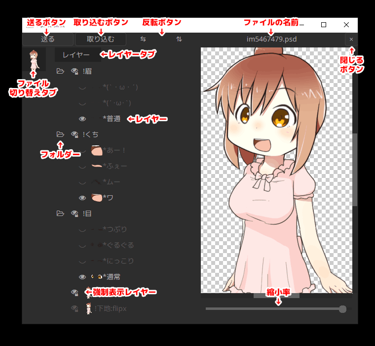

# PSD ファイルオブジェクト

PSD ファイルを読み込んだ際に生成されるオブジェクトを `PSD ファイルオブジェクト` と呼びます。  
その実態はスクリプトが記述された `テキスト` オブジェクトに [`描画@PSD`](psd.md#描画@PSD) が追加されたものです。

テキストの見た目を変更するプロパティ（フォント名やサイズや文字揃えなど）は変更しないでください。

テキスト入力欄には以下のオプション設定があり、必要に応じて書き換えて使用します。

設定名|説明
---|---
`lipsync`|[`口パク準備`](prep.md#口パク準備@PSDToolKit) があるレイヤー番号を半角整数で指定します。<br>これを指定すると `口パク準備` の設置区間に合わせて [subobj アニメーション効果](subobj.md) が使えます。<br>（ただし `口パク準備（音素のみ）` では使えません）
`mpslider`|[`多目的スライダー`](prep.md#多目的スライダー@PSDToolKit)があるレイヤー番号を `1` のような半角整数か、あるいは `{1, 2}` のような半角整数のテーブルで指定します。<br>複数のレイヤー番号を指定した際は、先に指定されたものが優先的に採用されます。<br>`mpslider` を指定すると `多目的スライダー` の設置区間に合わせて [subobj アニメーション効果](subobj.md) が使えます。<br>`lipsync` と `mpslider` が同時に指定されている場合は `多目的スライダー` の区間が使用されます。<br>複数の `多目的スライダー` を使用する場合は一番最初のレイヤー番号の区間が使用されます。
`scene`|シーン上でオブジェクトを使うときに、他のシーンと被らない番号を指定します。<br>変更しなくても問題なく動作しますが、一定の条件が揃った場合に描画負荷が極端に高くなることがあります。
`tag`|PSDToolKit ウィンドウに表示されている PSD ファイルのうち、どれに関連付けられているのかを示すタグです。<br>`0` 以外の値を指定してあると、対応する PSD ファイルが PSDToolKit ウィンドウになくても自動的に追加されます。
`sendguard`|PSDToolKit ウィンドウから `送る` ボタンで PSD ファイルを割り当てるときに、今までとは異なる PSD ファイルを割り当てようとした際に確認を行うかどうかを指定します。<br>`0` - 確認を行いません。<br>`1` - 本当に割り当てるか確認ダイアログを表示します。
`ls_locut`|`口パク準備` で `ローカット` を `0` にしている場合、ここで指定した値が使用されます。
`ls_hicut`|`口パク準備` で `ハイカット` を `0` にしている場合、ここで指定した値が使用されます。
`ls_threshold`|`口パク準備` で `しきい値` を `0` にしている場合、ここで指定した値が使用されます。
`ls_sensitivity`|`口パク準備` で `感度` を `0` にしている場合、ここで指定した値が使用されます。

## PSDToolKit ウィンドウ

`PSDToolKit ウィンドウ` は [`PSD ファイルオブジェクト`](#PSD_ファイルオブジェクト) のレイヤーの表示を切り替えたり、レイヤー名をコピーしたりするために使用するウィンドウです。

このウィンドウにファイルをドラッグ＆ドロップするとファイル切り替えタブにファイルを追加することもできます。

AviUtl のメインメニューから `編集`→`PSDToolKit`→`ウィンドウを表示` で表示できます。



機能名|説明
---|---
`送る` ボタン|現在の表示構成を拡張編集に送信します。<br>ただし `PSD ファイルオブジェクト` のテキスト入力欄が見えていないと送れません。<br>`Ctrl + S` のショートカットキーで押すこともできます。
`取り込む` ボタン|拡張編集上で最後に使われた表示構成を取り込みます。<br>取り込み対象は [`tag`](#PSD_ファイルオブジェクト) プロパティによって識別されます。
反転ボタン|画像を `⇆` で左右に、`⇅` で上下に反転します。<br>もし PSD ファイル側で [PSDTool の反転レイヤー指定機能](https://oov.github.io/psdtool/manual.html#original-feature-flip)が使われている場合はレイヤーも自動で切り替わり、文字の反転やアクセサリーの左右逆、着物の左前などの問題が自動で解消されます。
ファイルの名前|現在編集中の PSD ファイルの名前です。
`×`（閉じる）ボタン|編集中の PSD ファイルを閉じます。<br>閉じてもこのウィンドウから見えなくなるだけで、拡張編集では引き続き表示されます。<br>[`tag`](#PSD_ファイルオブジェクト) プロパティが設定されていれば、閉じても描画されたタイミングで復活します。
ファイル切り替えタブ|複数の PSD ファイルを読み込んでいる時は、ここに表示されるサムネイルをクリックすることで切り替えできます。
`レイヤー` タブ|[PSDTool](https://oov.github.io/psdtool/) で作成したお気に入りを一緒に読み込んでいる時は `レイヤー` の他に `お気に入り` や `シンプルV` タブが現れます。
レイヤー|`クリック` で表示／非表示を切り替えできます。<br>レイヤー名が `*` で始まる [PSDTool のラジオボタン化機能](https://oov.github.io/psdtool/manual.html#original-feature-asterisk)を利用したレイヤーは、グループ内で常にひとつだけ表示された状態になります。<br>`Ctrl + クリック` すると同じ階層の中でクリックしたレイヤーのみを表示します。<br>`右クリック` すると、レイヤーの名前をクリップボードにコピーしたりできるメニューが表示されます。
フォルダー|クリックで開閉できます。
強制表示レイヤー|右下に鍵マークがついているのは PSD ファイル側で [PSDTool の強制表示化機能](https://oov.github.io/psdtool/manual.html#original-feature-exclamation)を使っているレイヤーです。<br>非表示にするとおかしな表示状態になることが予めわかっているレイヤーに設定されています。
縮小率|PSDToolKit ウィンドウ内での縮小率の設定です。<br>ここでの縮小率は拡張編集側には反映されません。

# 字幕表示

`字幕表示` は [`字幕準備`](prep.md#字幕準備) で用意されたテキストを画面に表示するためのオブジェクトです。  
その実態はスクリプトが記述された `テキスト` オブジェクトです。

`字幕表示` は拡張編集の右クリックメニューから `メディアオブジェクトの追加`→`PSDToolKit`→`字幕表示` で作成できます。

`字幕表示` では `字幕準備` の設置区間に合わせて [subobj アニメーション効果](subobj.md) が使用可能です。

テキスト入力欄には以下の設定があります。

設定名|説明
---|---
`layer`|[`字幕準備`](prep.md#字幕準備)があるレイヤー番号を半角整数で指定します。
`wordwrap.mode`|テキストの自動折り返しに関する設定です。<br>`0` - しない<br>`1` - する<br>`2` - 禁則処理付き<br>`3` - 文節区切り
`wordwrap.width`|自動折り返しの幅を指定します。<br>`wordwrap.mode` が `0` の場合は無視されます。
`wordwrap.model`|使用する BudouX モデルを指定します。<br>`"ja"` - 日本語モデル<br>`JSONファイルへのパス` - カスタムモデルを読み込みます。<br>この設定は `wordwrap.mode = 3` のときのみ有効です。

## テキストの自動折り返しについて

[`字幕表示`](#字幕表示) や [`字幕表示（キャッシュ）`](#字幕表示（キャッシュ）) では、`wordwrap.mode` を `1` 以上にすることでテキストの自動折り返しを有効化することができます。

自動折り返しが有効なときに限り、以下のように `<nobr>` タグを使うことで改行禁止区間を指定することができます。

```
文章の途中で<nobr>改行させたくない場所</nobr>を指定できます。
```

また、`<wbr>` タグを使用すると、改行してもいい場所を指定することもできます。  
（改行する必要がないときは単に無視されます）

`<wbr>` タグは `<nobr>` タグの中で使用することもできます。

```
今日の晩御飯は<nobr>カレー<wbr>ライス</nobr>です。
```

もし `wordwrap.mode` が `3` のときの文節区切りの精度が低いと感じる場合は、`wordwrap.model` にファイルパスを入力することで、カスタムモデルを指定することができます。  
カスタムモデルの作り方は [BudouX のドキュメント](https://github.com/google/budoux#building-a-custom-model) を参照してください。

### 字幕表示以外での自動折り返し

例えばテキストオブジェクトで以下のように記述すると、字幕表示ではない場所でも自動折り返しを行うことができます。

```
<?s,o=[==[
こんにちは
]==],{mode = 3, width = 800}
mes(require("PSDToolKit").wordwrap(s,o,true))?>
```

キャッシュテキストとの併用もできます。

```
<?m,s,o=    0    ,[==[
ここにテキストを書く
]==],{mode = 3, width = 800}
require("CacheText").mes(require("PSDToolKit").wordwrap(s,o,true),m)?>
```

上記の例では `{mode = 3, width = 800}` のみを指定していますが、実際には以下のように多数の設定があります。

```lua
{
  font = "MS UI Gothic"    -- フォント名
  size = 9,                -- フォントサイズ
  bold = false,            -- 太字
  italic = false,          -- イタリック
  width = 800,             -- 自動折り返しの幅
  mode = 0,                -- 自動折り返しのモード(0 ~ 3)
  spacing = 0,             -- 文字間隔(-100 ~ 100)
  monospace = false,       -- 等間隔モード
  high_resolution = false, -- 高精度モード
  adjust_last = 0,         -- 最終行調整(0.0 ~ 1.0)
  model = "ja",            -- BudouX モデル
}
```

なお、拡張編集 0.92 以外で使用した場合やテキストオブジェクト以外の場所から呼び出されたときなど、状況によってはフォント設定が正しく反映されない場合があります。  
そのような場合に上記のオプションを使えばフォントを指定することができます。

# 字幕表示（キャッシュ）

`字幕表示（キャッシュ）` は [`字幕準備`](prep.md#字幕準備) で用意されたテキストを画面に表示するためのオブジェクトです。  
基本的な機能は [`字幕表示`](#字幕表示) と同じですが、それに加えて更にキャッシュ機構が追加されており、うまく活用することによって描画コストを下げることができます。

`字幕表示（キャッシュ）` は拡張編集の右クリックメニューから `メディアオブジェクトの追加`→`PSDToolKit`→`字幕表示（キャッシュ）` で作成できます。

`字幕表示（キャッシュ）` では `字幕準備` の設置区間に合わせて [subobj アニメーション効果](subobj.md) が使用可能です。

テキスト入力欄には以下の設定があります。

設定名|説明
---|---
`layer`|[`字幕準備`](prep.md#字幕準備)があるレイヤー番号を半角整数で指定します。
`cache`|キャッシュを有効にするかを設定します。<br>通常の用途では`0` が最適な設定です。<br>`-1` - 常時無効<br>`0` - オブジェクトを選択していなければ有効<br>`1` - 常時有効
`wordwrap.mode`|テキストの自動折り返しに関する設定です。<br>`0` - 自動折り返ししない<br>`1` - 自動折り返しする<br>`2` - 禁則処理付きで自動折り返しする<br>`3` - 文節を考慮して禁則処理付きで自動折り返しする
`wordwrap.width`|自動折り返しの幅を指定します。<br>`wordwrap.mode` が `0` の場合は無視されます。
`wordwrap.model`|使用する BudouX モデルを指定します。<br>`"ja"` - 日本語モデル<br>`JSONファイルへのパス` - カスタムモデルを読み込みます。<br>※ この設定は `wordwrap.mode = 3` のときのみ有効です。
