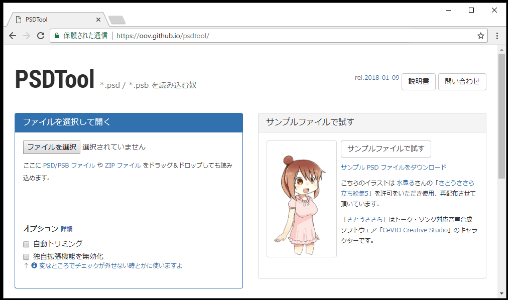
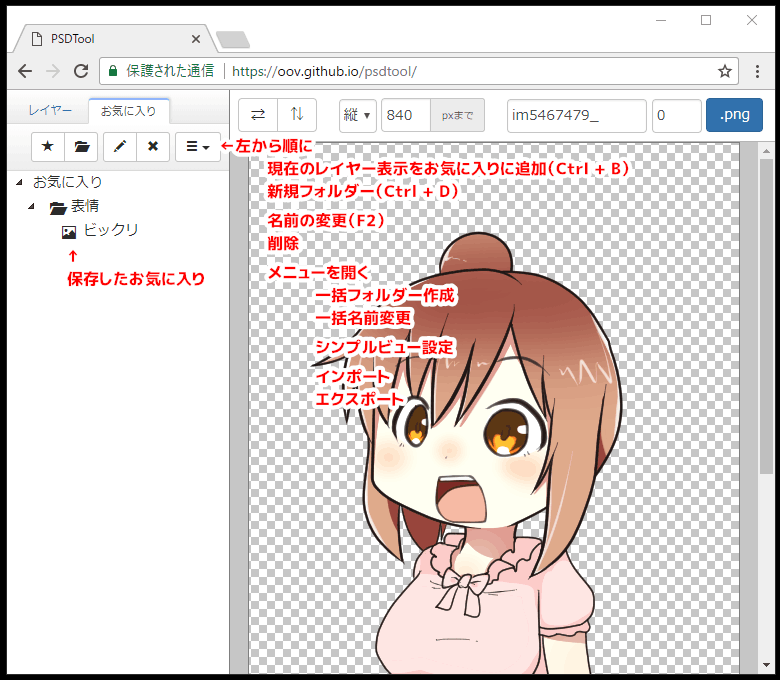
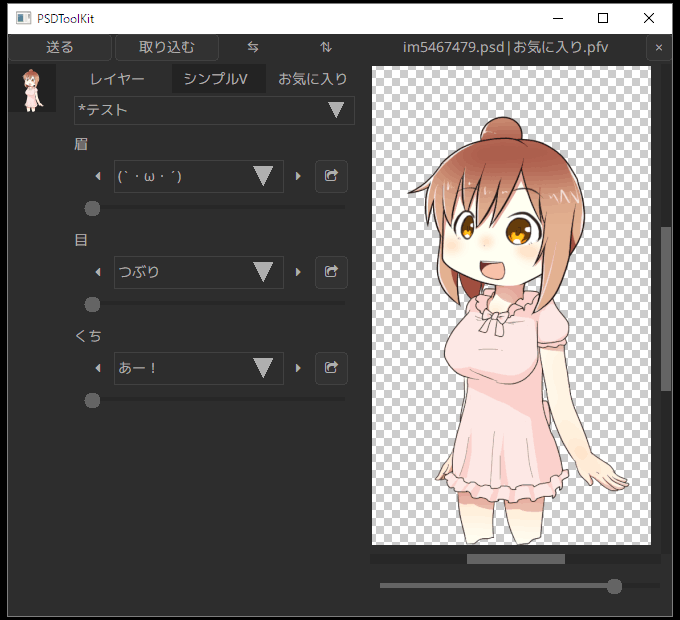

# PSDTool とは

[PSDTool](https://oov.github.io/psdtool/) はブラウザ上で PSD ファイルの閲覧や PNG ファイルへの保存ができるオンラインツールで、PSDToolKit と同じ作者によって作成されています。

PSDTool には気に入ったレイヤーの組み合わせを保存しておける「お気に入り」という仕組みがあり、このお気に入りをファイルに書き出すことによって、PSDToolKit からもお気に入りを利用できるようになります。

また、お気に入りにはより進んだ「シンプルビュー」という仕組みもあり、これを設定すると更に高度で便利な機能を利用することができるようになります。

このドキュメントでは PSDTool の使い方、お気に入りの作り方、シンプルビューの作り方、そして PSDToolKit でのお気に入りの読み込み方について解説していきます。

# PSDTool に PSD ファイルを読み込む

PSDTool で PSD ファイルを読み込むには、この場所に PSD ファイルをドラッグ＆ドロップします。

概ね PSDToolKit と同じ画面が現れます。

機能名|説明
---|---
レイヤータブ お気に入りタブ|レイヤー一覧とお気に入り編集画面を切り替えるためのタブです。
`⇆`（左右反転）ボタン `⇅`（上下反転）ボタン|画像を反転します。 もし PSD ファイル側で[反転レイヤー指定機能](https://oov.github.io/psdtool/manual.html#original-feature-flip)が使われている場合はレイヤーも自動で切り替わり、文字の反転やアクセサリーの左右逆、着物の左前などの問題が自動で解消されます。
フォルダー|レイヤーを束ねているフォルダーです。開閉機能はありません。 また、このスクリーンショットでは PSD ファイル側で[強制表示化機能](https://oov.github.io/psdtool/manual.html#original-feature-exclamation)が使われており、チェックボックスやラジオボタンも表示されていません。
レイヤー|クリックで表示／非表示を切り替えできます。 [ラジオボタン化機能](https://oov.github.io/psdtool/manual.html#original-feature-asterisk)を利用したレイヤーはチェックボックスの代わりにラジオボタンになり、グループ内で常にひとつだけ表示された状態になります。 `Ctrl + クリック` すると同じ階層の中でクリックしたレイヤーのみを表示します。
強制表示レイヤー|チェックボックスもラジオボタンも表示されていないのは、PSD ファイル側で[強制表示化機能](https://oov.github.io/psdtool/manual.html#original-feature-exclamation)を使っているレイヤーです。 非表示にするとおかしな表示状態になることが予めわかっているレイヤーに設定されています。

## ラジオボタン化／強制表示化／反転レイヤー指定機能について

これらは [PSDTool が持つ独自拡張機能](https://oov.github.io/psdtool/manual.html#original-feature)であり、PSD ファイルに予め備わっているような機能ではありません。

一般的な PSD ファイルでは当然これらの仕組みは使われておらず、そればかりか稀に意図しない箇所で誤って機能が適用されてしまうこともありますが、そのような場合は PSD ファイルをドラッグ＆ドロップする前に `独自拡張機能を無効化` のチェックボックスにチェックを入れておくと問題を回避できます。

# PSDTool のお気に入り

## お気に入りへの保存

表示の組み合わせをお気に入りに保存するには `お気に入り` タブに切り替えて `★` ボタンを押すか、`Ctrl + B` のショートカットキーを押します。

機能名|説明
---|---
現在のレイヤー表示を お気に入りに追加 （Ctrl + B）|お気に入りに現在の表示を追加します。
新規フォルダー （Ctrl + D）|フォルダーを作成します。 フォルダーは項目の整理だけではなく、後述するフィルターのためにも使用します。
名前の変更（F2）|保存されているお気に入りやフォルダーの名前を変更します。
削除|保存されているお気に入りやフォルダーを削除します。
メニューを開く|より詳細なメニューを表示します。
一括フォルダー作成|複数のフォルダーを一気に作る場合に有用です。
一括名前変更|複数のアイテムの名前を変更する場合に有用です。 TAB / Shift + TAB を使うとカーソル移動もキーボードで行なえます。
シンプルビュー設定|自分でお気に入りファイルを配布する場合に設定が行なえます。
インポート|お気に入りファイルを読み込めます。
エクスポート|お気に入りファイルの書き出しや、お気に入りの内容を zip ファイルに書き出せます。
保存したお気に入り|選択するとプレビュー表示に切り替わり、ダブルクリックするとレイヤー一覧に読み込まれます。 スクリーンショットでは「表情」というフォルダーを作成し、その中に「ビックリ」という名前で保存しています。

## フィルターについて

保存したお気に入りには PSD ファイルに存在するすべてのレイヤーについて、表示／非表示の状態が保存されています。

そのため、例えば現在の表示が「服装が私服、表情が怒り」であったとしても、「服装が制服、表情が笑み」のお気に入りを読み込めば「服装」も「表情」も一緒に変更されてしまい、これが不便なことがあります。

こういう場合に「フィルター」を予め設定しておくと、お気に入りに保存された構成の中から一部分のみを適用することができるようになります。

上記の例でフィルターで表情のみが適用されるように設定すれば、どんな服装に対しても「表情が笑み」を適用できるようになり、活用範囲が大幅に向上します。

### フィルターの設定

フィルターを設定するにはお気に入りにフォルダーを追加し、そのフォルダーをダブルクリックします。

まずは `フィルター機能を使用する` にチェックを入れ、続けて、例えばお気に入りから「目」に関する設定だけを読み込みたい場合は、スクリーンショットのように目に関連するレイヤーだけにチェックを付け、ダイアログを閉じます。

このフォルダーの子階層に入れた項目は、読み込んでも「目」以外が変化しないようになります。

https://www.youtube.com/watch?v=-L_IzlyGxNM

上記の URL は PSDTool のマニュアルに記載されている、フィルター機能の実演デモです。表情がバラバラに登録されたお気に入りの親フォルダーにフィルターを設定すると、口だけが変化するようになります。

#### フィルターの設定を効率的に行うには

[フィルターの設定](#フィルターの設定)で「目」の設定したように、一部のパーツのみが適用できるフォルダーがあると、次は色々な目の表示パターンをお気に入りに保存したくなることと思います。

表示パターンを切り替えて保存したいレイヤーが同じ親フォルダーの直下にある時は、もっと効率的に設定する方法があります。

このような時は、**保存したいレイヤーのどれかをクリックした後**に以下のショートカットキーが使えます。

ショートカットキー|説明
---|---
`Shift + Ctrl + G`|同じ階層にあるレイヤーをグループとして、それぞれを単独で選択した全てのパターンでお気に入りを自動生成します。 つまり「一番上のレイヤーのみを表示」→「お気に入りに保存」→「次のレイヤーのみを表示」→「お気に入りに保存」... という操作を自動的に行います。 この階層以外のチェックボックスは触りません。
`Shift + Ctrl + Alt + G`|`Shift + Ctrl + G` とほとんど同じ動作ですが、自動生成されたお気に入りを入れるためのフォルダーも自動生成し、フィルターも自動的に設定します。 つまり、このパターンに当てはまる時は事前にフォルダーを作る必要すらありません。

なお、保存したい対象がレイヤーではなくフォルダーであっても構いません。  

## シンプルビューについて

[フィルターについて](#フィルターについて)の項で、この機能を使うと「服装だけ」とか「表情だけ」とか、もっと細かく「目だけ」とか「眉だけ」とかをお気に入りから設定できるようになる、というのを紹介しました。

この仕組みをより発展させると、例えばキャラクターの部位ごとのパーツ切り替えを、お気に入りから選ぶことで実現できるようになります。

この発想を機能として取り入れたのが「シンプルビュー」です。

機能名|説明
---|---
`レイヤーツリーに切り替え` ボタン|レイヤーツリーとシンプルビューを切り替えるためのボタンです。
親フォルダーの切り替え|シンプルビューの大分類を切り替えるためのコンボボックスです。
パーツの切り替え|フィルターを設定したフォルダーによって作られる、パーツ切り替え用コンボボックスです。

レイヤーツリーの代わりにスライダーなどでパーツが選択できるようになっています。

シンプルビューを設定すると好きな粒度で好きなアイテム数を好きな順番に並べることができるので、用途に合わせて最適化された選択項目を自分で用意することができます。

### シンプルビューの設定

シンプルビューはフィルター機能を活用した仕組みなので、お気に入りの中で設定することができます。

1. **先頭に `*` （アスタリスク）を付けた親フォルダーを作成**  
フォルダーを作り、その名前の先頭を半角のアスタリスク `*` にします。  
このフォルダーがシンプルビューの親フォルダーになります。
2.  **その子階層にフォルダーを作り、フィルターを設定する**  
[フィルターの設定](#フィルターの設定)の項と同じようにフォルダーにフィルターを設定します。
3. **その子階層に表情パターンなどを必要なだけ登録する**  
必要なパターンのお気に入りを保存していきます。
4. **手順2と手順3を必要なだけ繰り返す**  
手順2～3は[フィルターの設定を効率的に行うには](#フィルターの設定を効率的に行うには)の項で紹介したショートカットキーを使うと効率よく作業できます。

以上の手順でシンプルビューが作成できます。

シンプルビューの設定が完了すると、`レイヤー` タブに戻った時に `シンプルビューに切り替え` ボタンがタブのすぐ下に現れます。

## お気に入りのエクスポート

作成したお気に入りは、`*.pfv` ファイルにエクスポートできます。

エクスポートしなくてもブラウザには保存されますが、PSD ファイル側が変わったり意図しないタイミングで失ってしまうかも知れないので、ファイルにエクスポートしておくと安心です。

また、エクスポートした `*.pfv` ファイルは PSDToolKit に持ち込む際にも必要になります。

### お気に入りをエクスポートするには

[お気に入りへの保存](#お気に入りへの保存)の項で紹介した画面にあるメニューから `エクスポート` を選ぶとエクスポート用のダイアログが表示されるので、その中にある `PFV ファイルをエクスポート` を押すとお気に入りがエクスポートされます。

# PSDToolKit で PSDTool のお気に入りを読み込む

エクスポートしたお気に入りを PSDToolKit で読み込むには、同じフォルダー内に PSD ファイルと PFV ファイルを配置し、両方を掴んで拡張編集のタイムラインにドラッグ＆ドロップします。

このようにして読み込むと、PSDToolKit 側のウィンドウでお気に入りや、シンプルビューが設定されていればシンプルビューも使えるようになっています。  
（シンプルビューは表示スペースの都合で `シンプルV` と表記されます）

`お気に入り` タブでプレビューがなかったり `シンプルV` タブで見慣れないボタンがあるなど一部に相違はありますが、概ね同じように使用できます。

シンプルビューにあるボタンを押すとレイヤーで右クリックした時とほぼ同じ内容のメニューが現れ、同じように使うことができます。

## 注意事項

PSDToolKit にはお気に入りの編集機能は一切なく、読み込み専用です。  
途中でお気に入りを変更したくなった時は再度 PSDTool で作業する必要があります。
