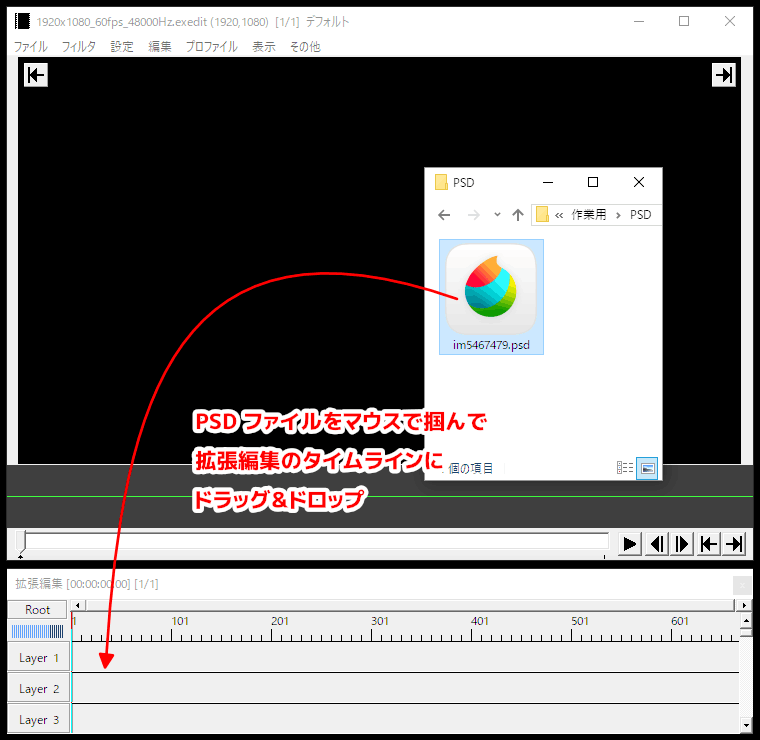
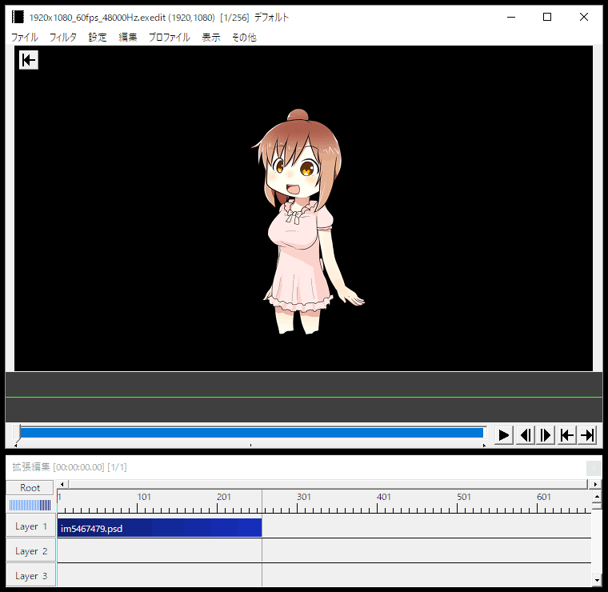
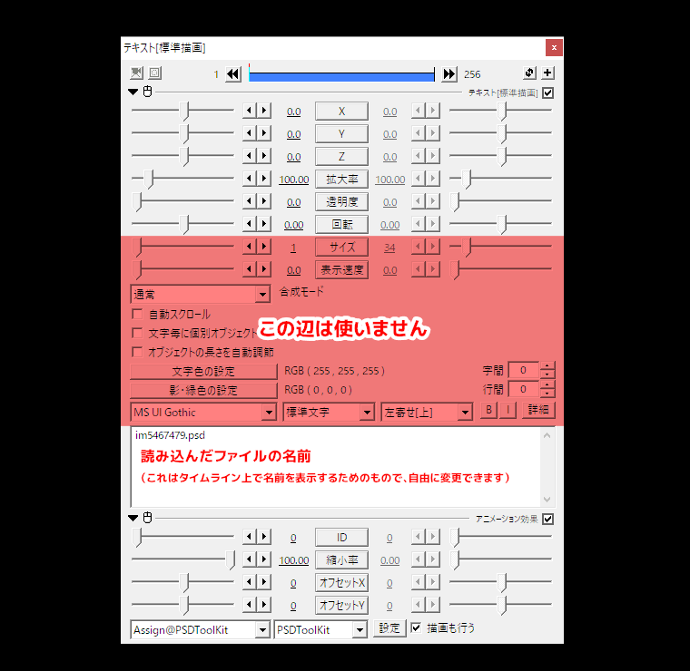
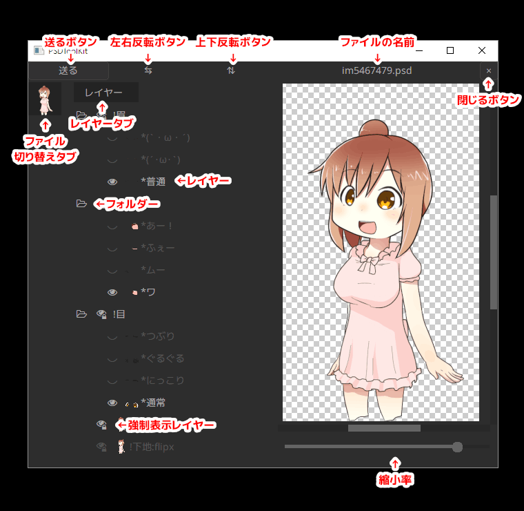
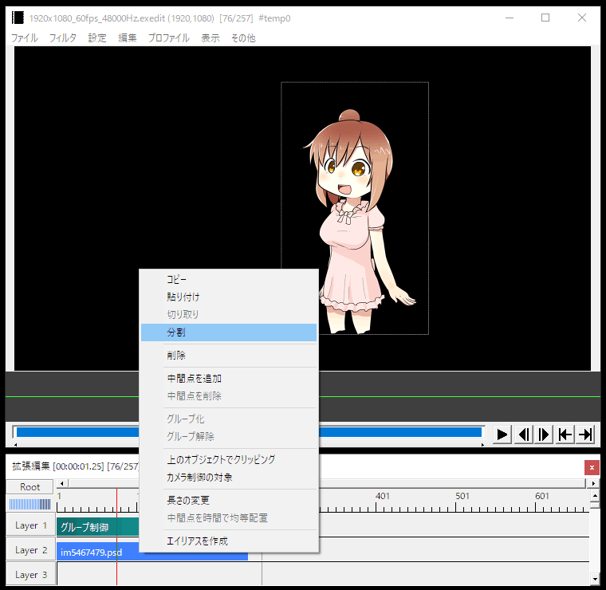
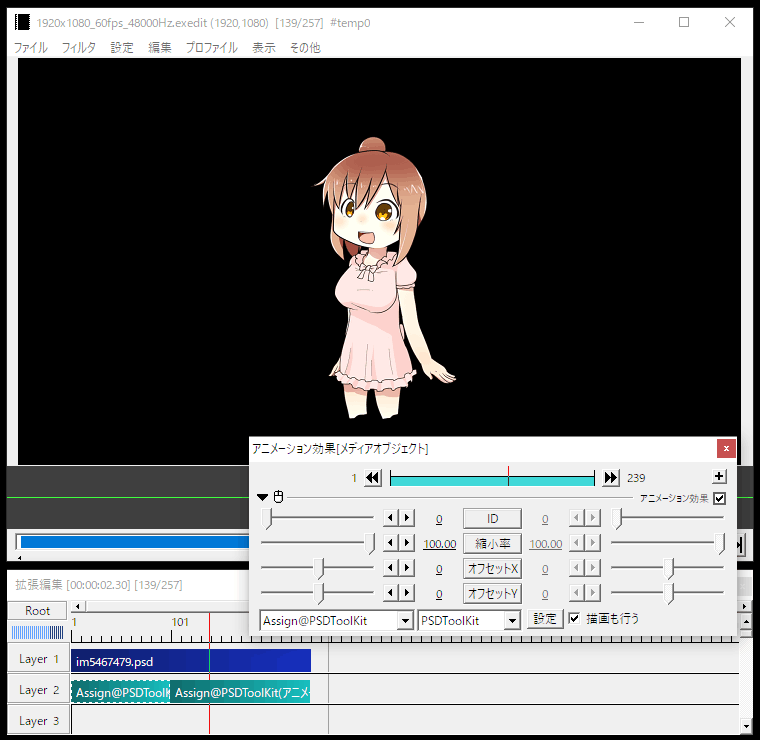

# PSD ファイルとは

PSD ファイルとは、Adobe Photoshop 用の画像ファイルフォーマットです。  
しかし今日では様々なソフトでこのファイル形式の読み込み／保存に対応しています。

一般的なお絵かきソフトには絵を何枚も重ね合わせることで１枚の絵を表現する `レイヤー` と呼ばれる機能があり、この機能を使って描いたイラストなどを、異なるソフトへ持ち込む際などにも PSD ファイルはよく利用されます。  
（拡張編集における `レイヤー` もほぼ同じ概念です）

PSDToolKit では PSD ファイルを読み込み、そして重ね合わせる `レイヤー` を切り替えることによってキャラクターの表情の変化などを表現します。

## 注意事項

PSD ファイルは利用規約やキャラクターライセンスなどを厳守の上で利用してください。

# PSD ファイルの読み込み

PSDToolKit で PSD ファイルを読み込むには、編集中のタイムライン上へ PSD ファイルをドラッグ＆ドロップします。  
（まだ拡張編集でプロジェクトを作成していない場合は事前に新規作成などを行ってください）

正常に動作していれば、PSD ファイルがタイムラインに追加されます。

PSD ファイルを読み込んだオブジェクトには、以下のようなプロパティがあります。

設定項目が多くあるように見えますが、実際には `テキスト` のオブジェクトに `アニメーション効果` を追加しているだけの単純なオブジェクトで、テキスト専用のプロパティは使いません。

プロパティ名|説明
---|---
`ID`|普通に使用する上では変更する必要はありません。 拡張編集のシーン機能を使う際に、PSD ファイルが原因で異常に重い時に ID を変更すると問題が回避できることがあります。
`縮小率`|元のサイズより画像を縮小して表示します。 ここで縮小しても描画負荷はほとんど下がらないため、動作が重いのを回避したい場合は PSD ファイル自体を縮小しておく必要があります。
`オフセットX`|オブジェクト内での描画位置をX方向にずらします。
`オフセットY`|オブジェクト内での描画位置をY方向にずらします。
`描画も行う`|このチェックを外すとすぐに描画を行わなくなります。 より高度な機能を利用する場合にはチェックを外します。

また、`設定` ボタンを押すと現在読み込まれている画像の設定内容が確認できます。  
このボタンが隠れていると後述する `送る` ボタンが使用できないので注意してください。

## 画像が表示されないときは

PSD ファイルをドラッグ＆ドロップして拡張編集のタイムライン上にオブジェクトが作成されたのに、画像が描画されていないように見えるケースがあります。

- PSD ファイル上で全てのレイヤーを非表示にして保存されている場合
  - 後述する方法でレイヤーの表示／非表示を切り替えてみてください。
- 画像の幅と高さが大きすぎて、画面外に描画されている場合
  - `縮小率`/`オフセットX`/`オフセットY` を使用して、画像を縮小してみてください。  
  ただし、このようなファイルは動画作成中も負荷が高くなる可能性があるため、PSD ファイルを予め縮小してから読み込むことも検討してみてください。

# レイヤーの切り替え

読み込んだ画像のレイヤーを切り替えるには、AviUtl のメインメニューから `編集`→`PSDToolKit`→`ウィンドウを表示`（またはショートカットキー `Ctrl+W`）を選びます。

以下のようなウィンドウが表示されます。

機能名|説明
---|---
`送る` ボタン|現在の表示構成を拡張編集に送信します。 ただし、AviUtl 側で `設定` ボタンが見えていないと送れません。
`⇆`（左右反転）ボタン|画像を左右反転します。 もし PSD ファイル側で [PSDTool の反転レイヤー指定機能](https://oov.github.io/psdtool/manual.html#original-feature-flip)が使われている場合はレイヤーも自動で切り替わり、文字の反転やアクセサリーの左右逆、着物の左前などの問題が自動で解消されます。
`⇅`（上下反転）ボタン|画像を上下反転します。 もし PSD ファイル側で [PSDTool の反転レイヤー指定機能](https://oov.github.io/psdtool/manual.html#original-feature-flip)が使われている場合はレイヤーも自動で切り替わります。
ファイルの名前|現在編集中の PSD ファイルの名前です。
`×`（閉じる）ボタン|編集中の PSD ファイルを閉じます。 閉じてもこのウィンドウから見えなくなるだけで、拡張編集では引き続き表示されます。 閉じたファイルを復活させる方法はありませんが、同じ PSD ファイルをこのウィンドウに直接ドラッグ＆ドロップすることで再度表示できます。
ファイル切り替えタブ|複数の PSD ファイルを読み込んでいる時は、ここに表示されるサムネイルをクリックすることで切り替えできます。
`レイヤー` タブ|[PSDTool](https://oov.github.io/psdtool/) で作成したお気に入りを一緒に読み込んでいる時は `レイヤー` の他に `お気に入り` や `シンプルV` タブが現れます。
レイヤー|クリックで表示／非表示を切り替えできます。 レイヤー名が `*` で始まる [PSDTool のラジオボタン化機能](https://oov.github.io/psdtool/manual.html#original-feature-asterisk)を利用したレイヤーは、グループ内で常にひとつだけ表示された状態になります。 `Ctrl + クリック` すると同じ階層の中でクリックしたレイヤーのみを表示します。
フォルダー|クリックで開閉できます。
強制表示レイヤー|右下に鍵マークがついているのは PSD ファイル側で [PSDTool の強制表示化機能](https://oov.github.io/psdtool/manual.html#original-feature-exclamation)を使っているレイヤーです。 非表示にするとおかしな表示状態になることが予めわかっているレイヤーに設定されています。
縮小率|PSDToolKit ウィンドウ内での縮小率の設定です。 ここでの縮小率は拡張編集側には反映されません。

このウィンドウでレイヤーの表示などを切り替え、`送る` ボタンを押すと拡張編集側に変更が反映されます。

## `「設定」ボタンが見つかりませんでした` と表示されるときは

`送る` ボタンは「拡張編集側で開かれているオブジェクトのプロパティウィンドウから可視状態の `設定` ボタンを探し、クリックし、設定を書き込み、`OK` ボタンを押す」という操作を自動化しているだけのボタンです。

そのため、例えばアニメーション効果の左上にある開閉ボタンを押して閉じている場合などは `設定` ボタンが不可視になっているため設定を反映することができません。

## ラジオボタン化／強制表示化／反転レイヤー指定機能について

これらは [PSDTool が持つ独自拡張機能](https://oov.github.io/psdtool/manual.html#original-feature)であり、PSD ファイルに予め備わっているような機能ではありません。

一般的な PSD ファイルでは当然これらの仕組みは使われておらず、そればかりか稀に意図しない箇所で誤って機能が適用されてしまうこともありますが、そのような場合はお絵かきソフトなどを使用してレイヤー名を変更することで問題なく扱えるようになります。

# タイムラインの途中でレイヤーを切り替える

タイムラインの途中でレイヤー切り替えを行うには、オブジェクトの分割を利用するのがもっとも基本的な方法です。

分割した前後でレイヤーの表示構成を変えることで、表示の切り替えを実現します。

また、オブジェクトを分割した場合は座標や拡大率などの管理が煩雑になるので、必要に応じてグループ制御などを併用すると扱いやすくなります。

## グループ制御を使わない方法

PSD ファイルを描画しているオブジェクトは元々 `テキスト` に `アニメーション効果` のフィルタ効果を追加しただけのオブジェクトなので、この `アニメーション効果` を削除し別レイヤーに配置させれば、グループ制御を使わなくても座標や拡大率などを一箇所で管理することができます。

独立した `アニメーション効果` は右クリックメニューの `メディアオブジェクトの追加`→`フィルタ効果の追加`→`アニメーション効果` と辿ると追加できます。

### ヒント: 処理の順番

拡張編集では基本的に上から下のレイヤーに向かって順番に処理が実行されていきます。

また、オブジェクトのプロパティの右上にある `＋` ボタンを押すとフィルター効果が追加できますが、この効果も上から順番に実行されていきます。

この処理順が守られている限りはどのような配置でも上手く動作します。