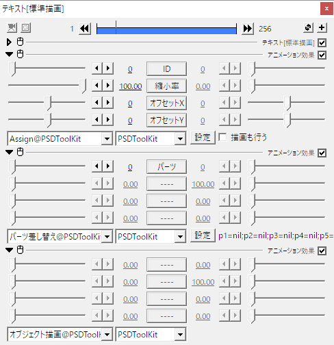
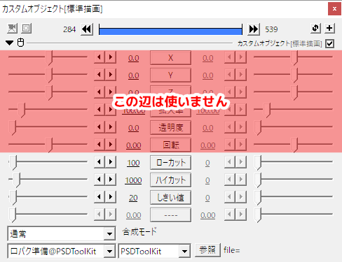
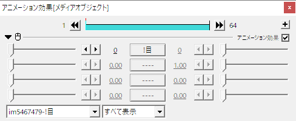
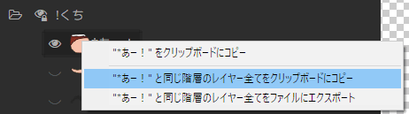
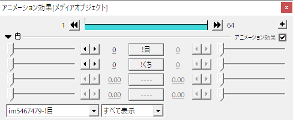

# 高度なレイヤー切り替え機能について

[タイムラインの途中でレイヤーを切り替える](psd.md#タイムラインの途中でレイヤーを切り替える)の項ではレイヤーの切り替え方法について紹介しましたが、この方法は手間が少なくない上プログラムからの制御も難しいため、細かい制御を行う用途には向いていません。

このページで紹介する `パーツ差し替え` / `目パチ` / `口パク` / `同じ階層のレイヤーをエクスポート` を使うと、より効率的に、また効果的にレイヤー切り替えを行うことができるようになります。

なお、ここで紹介する方法は PSD ファイル側で表示切り替えに必要になるレイヤー数が少ない場合にのみ有効で、より柔軟にレイヤーを切り替えたい場合は [PSDTool でシンプルビューを作成](pfv.md)するのがオススメです。

# `オブジェクト描画`

このページで紹介する高度な描画機能を利用する場合は PSD ファイルを読み込んだオブジェクト側で `描画も行う` のチェックボックスを外し、代わりに `オブジェクト描画` の `アニメーション効果` を配置し、オブジェクト描画までの間に行いたい処理を配置する必要があります。


1. **`描画も行う`のチェックを外す**  
すぐに描画せずに途中に処理を挟めるようにします。
2. **`オブジェクト描画`を配置**  
`アニメーション効果` の `オブジェクト描画` を配置し、最終的な描画処理をここで行います。  
`オブジェクト描画` は拡張編集の右クリックメニューから `メディアオブジェクトの追加`→`PSDToolKit`→`オブジェクト描画` を選んだり、手動でアニメーション効果を選択することで挿入できます。
3. **必要な処理を配置する**  
この２つのオブジェクトの間に、様々な処理を挟み込みます。

## `オブジェクト描画` までをひとつのレイヤー内で行う

必ずしも `オブジェクト描画` を独立したレイヤーに配置する必要はないので、例えば以下のように全て `フィルタ効果` として追加しても、処理の順番さえあっていれば問題なく動作します。




# `パーツ差し替え`

`パーツ差し替え` は拡張編集上のスライダーでレイヤーを切り替えできるようにする `アニメーション効果` です。

これを使うと編集作業中に PSDToolKit ウィンドウを使う頻度が減るため、煩雑な作業が減り作業効率が向上します。

ただし拡張編集の `パラメータ設定` ダイアログには文字数上限や項目数上限があり、多数のパーツを一気に指定すると上手く設定が保存されなくなることがあります。

よりたくさんの項目から選びたい場合は[同じ階層のレイヤーをエクスポート](#同じ階層のレイヤーをエクスポート)の利用を検討してください。

## `パーツ差し替え` の使い方


1. **PSDToolKit ウィンドウを表示する**  
あとで必要になる PSDToolKit ウィンドウを予め表示しておきます。
2. **タイムラインにパーツ差し替えを配置**  
PSDを読み込んだオブジェクトと [`オブジェクト描画`](#オブジェクト描画) との間に `パーツ差し替え` を配置します。  
`パーツ差し替え` は拡張編集の右クリックメニューから `メディアオブジェクトの追加`→`PSDToolKit`→`パーツ差し替え` を選んだり、手動でアニメーション効果を選択することで挿入できます。
3. **「設定」を押す**  
パターンを割り当てるために `パラメータ設定` ダイアログを開きます。  
このダイアログを開いている間は AviUtl 全体が操作できなくなるため、予め PSDToolKit ウィンドウを開いておく必要があります。
4. **レイヤーを右クリックして、メニューから登録したい場所を選ぶ**  
PSDToolKit ウィンドウでレイヤーを右クリックするとメニューが現れるので、登録したい場所を選ぶと登録されます。

`パーツ差し替え` には以下のプロパティがあります。


プロパティ名|説明
---|---
`パーツ`|設定したパーツのどれを使うかを選択するスライダーです。<br>`0` - パーツを使用しない<br>`1`～`16` - 選択したパーツを使用する

# `目パチ`

PSDToolKit では瞬きのことを「目パチ」と呼び、レイヤーを切り替えることでこれを表現するための `アニメーション効果` が付属しています。

## `目パチ` の使い方

少なくとも「開いた目」と「閉じた目」の2種類以上のパターンがあれば目パチは利用可能です。


1. **PSDToolKit ウィンドウを表示する**  
あとで必要になる PSDToolKit ウィンドウを予め表示しておきます。
2. **タイムラインに目パチを配置**  
PSDを読み込んだオブジェクトと [`オブジェクト描画`](#オブジェクト描画) との間に `目パチ` を配置します。  
`目パチ` は拡張編集の右クリックメニューから `メディアオブジェクトの追加`→`PSDToolKit`→`目パチ` を選んだり、手動でアニメーション効果を選択することで挿入できます。
3. **「設定」を押す**  
パターンを割り当てるために `パラメータ設定` ダイアログを開きます。  
このダイアログを開いている間は AviUtl 全体が操作できなくなるため、予め PSDToolKit ウィンドウを開いておく必要があります。
4. **レイヤーを右クリックして、メニューから登録したい場所を選ぶ**  
PSDToolKit ウィンドウでレイヤーを右クリックするとメニューが現れるので、登録したい場所を選ぶと登録されます。

`目パチ` には以下のプロパティがあります。


プロパティ名|説明
---|---
`間隔(秒)`|次に目パチのアニメーションを始めるまでの秒数です。
`速さ`|目パチの速さをフレーム単位で指定します。
`オフセット`|目パチを始めるタイミングをずらします。<br>複数キャラクターに `目パチ` を設定するとそのままでは同時に目パチしてしまうので、必要に応じて `オフセット` で調整してください。

## `目パチ` を Lua スクリプトから使う

以下のような Lua スクリプトを使うと、スクリプトから目パチを行えます。

```lua
-- 上から順に 閉じ から 開き へのパターンを入れておく
local patterns = {
  "v1.!目/*閉じ",
  "v1.!目/*ほぼ閉じ",
  "v1.!目/*半目",
  "v1.!目/*ほぼ開き",
  "v1.!目/*開き"
}
local interval = 4 -- 間隔(秒)
local speed    = 1 -- 速さ
local offset   = 0 -- オフセット
local blinker = require("PSDToolKit").Blinker.new(patterns, interval, speed, offset) -- 目パチオブジェクトを生成

PSD:addstate(blinker) -- 生成したオブジェクトをグローバル変数 PSD に割り当てる
```

以下のフォームを使うと、上記のコードで生成する目パチオブジェクトと同等のものを自動生成できます。

<form id="blinker-builder" class="ptk-script-builder">
<dl>
<dt>開き</dt><dd><input type="text" name="m4" autocomplete="off" placeholder="例: v1.!目/*開き"></dd>
<dt>ほぼ開き</dt><dd><input type="text" name="m3" autocomplete="off" placeholder="例: v1.!目/*ほぼ開き"></dd>
<dt>半開き</dt><dd><input type="text" name="m2" autocomplete="off" placeholder="例: v1.!目/*半開き"></dd>
<dt>ほぼ閉じ</dt><dd><input type="text" name="m1" autocomplete="off" placeholder="例: v1.!目/*ほぼ閉じ"></dd>
<dt>閉じ</dt><dd><input type="text" name="m0" autocomplete="off" placeholder="例: v1.!目/*閉じ"></dd>
</dl>
<dl>
<dt>間隔(秒)</dt><dd><input type="text" name="interval" autocomplete="off" value="4" placeholder="例: 4"></dd>
<dt>速さ</dt><dd><input type="text" name="speed" autocomplete="off" value="1" placeholder="例: 1"></dd>
<dt>オフセット</dt><dd><input type="text" name="offset" autocomplete="off" value="0" placeholder="例: 0"></dd>
</dl>
<dl>
<dt>出力</dt><dd><input type="text" name="output" value="" readonly="readonly"></dd><dd><button type="button" name="copy">クリップボードにコピー</button></dd>
</dl>
</form>

# 口パク

PSDToolKit では音声に合わせて口を動かすことを「口パク」と呼び、レイヤーを切り替えることでこれを表現するための `アニメーション効果` が付属しています。

しかし、口パクを行うためには、動き合わせる対象となる音声が必要になります。

そこで PSDToolKit では `口パク準備` という `カスタムオブジェクト` を提供しており、これを使うと `*.wav` ファイルの音量を元に「現在トーク中かどうか」を取得したり、`*.lab` ファイルを元に発音中の音素情報を得ることができるようになります。

そのため口パクを利用するためには

1. `口パク準備` を設置し、`*.wav` ファイルを設定する
2. `口パク 開閉のみ` や `口パク あいうえお` を設置し、`口パク準備` があるレイヤー番号を指定する

という手順を踏む必要があります。

## `口パク準備`

`口パク準備` は拡張編集の右クリックメニューから `メディアオブジェクトの追加`→`PSDToolKit`→`口パク準備` で挿入できます。

`口パク準備` はその名の通り **準備を行うためのオブジェクト** なので、これ単体では何もできません。



プロパティ名|説明
---|---
`ローカット`|音声の音量を取得する際に指定した周波数以下をカットしたあとの値を取得します。
`ハイカット`|音声の音量を取得する際に指定した周波数以上をカットしたあとの値を取得します。
`しきい値`|どのくらいの音量以上なら発言中として扱うかを指定します。<br>オーディオに声以外のノイズが含まれている場合はある程度大きな値に設定しないと誤認識することがあります。
`参照`|処理を行う対象の `*.wav` ファイルを指定します。<br>同じフォルダに同じ名前の `*.lab` ファイルがある場合は自動的に音素データも読み込まれます。

### `*.lab` ファイルとは

```
0 1150000 k
1150000 2400000 o
2400000 2900000 N
2900000 3450000 n
3450000 4350000 i
4350000 5250000 ch
5250000 5850000 i
5850000 6450000 w
6450000 7950000 a
```

上記のように音素のタイミング情報が 1/10,000,000 秒単位で書かれたシンプルなテキストベースのファイルです。

母音に合わせて口の形を変えるといった、より複雑な動作を行いたい場合に必要になります。

### `口パク準備` を効率よく作成するには

大抵のニーズにおいては音声が流れている時間と同じ区間に同じファイルを読み込んだ口パク準備を配置したいはずなので、PSDToolKit ではより簡単に `口パク準備` を作成できる方法を提供しています。

詳しくは [ドラッグ＆ドロップ拡張の `*.wav` ファイル](gcmzdrops.md#*.wav_ファイル) の項を参照してください。

## `口パク 開閉のみ`

`口パク 開閉のみ` は開閉のみのシンプルなアニメーションで、`目パチ` とほぼ同じ要領で設定できます。


1. **`口パク 開閉のみ` のアニメーション効果を追加**  
PSDを読み込んだオブジェクトと [`オブジェクト描画`](#オブジェクト描画) との間に `口パク 開閉のみ` を配置します。  
`目パチ` は拡張編集の右クリックメニューから `メディアオブジェクトの追加`→`PSDToolKit`→`口パク　開閉のみ` を選んだり、手動でアニメーション効果を選択することで挿入できます。
2. **`設定` ボタンを押して表情パターンを割り当て**  
設定方法は `目パチ` と全く同じですので詳細は割愛します。
3. **`口パク準備` にレイヤー番号を指定**  
アニメーションの基準になる [`口パク準備`](#口パク準備) が配置されているレイヤー番号を `口パク準備` の項目に指定します。  
このスクリーンショットでは `Layer 1` に配置されているので `1` を指定します。

以上の設定を行うことで、音声内容に合わせてアニメーションするようになります。

また、`口パク 開閉のみ` にはいくつかの設定項目があります。


プロパティ名|説明
---|---
`速さ`|口パクの速さをフレーム単位で指定します。
`口パク準備`|アニメーションの基準になる `口パク準備` が配置されているレイヤー番号を指定します。
`口パク準備がなくても有効`|チェックを入れると、`口パク準備` のオブジェクトがない区間でも `閉じ` のパターンが適用されるようになります。

### `口パク 開閉のみ` を Lua スクリプトから使う

以下のような Lua スクリプトを使うと、スクリプトから口パクを行えます。

```lua
-- 上から順に 閉じ から 開き へのパターンを入れておく
local patterns = {
  "v1.!口/*閉じ",
  "v1.!口/*ほぼ閉じ",
  "v1.!口/*半開き",
  "v1.!口/*ほぼ開き",
  "v1.!口/*開き"
}
local speed = 1 -- 速さ
local layerindex = 1 -- 口パク準備
local alwaysapply = true -- 口パク準備がなくても有効
local lipsync = require("PSDToolKit").LipSyncSimple.new(patterns, speed, layerindex, alwaysapply) -- 口パクオブジェクトを生成

PSD:addstate(lipsync) -- 生成したオブジェクトをグローバル変数 PSD に割り当てる
```

以下のフォームを使うと、上記のコードで生成する口パクオブジェクトと同等のものを自動生成できます。

<form id="lipsyncsimple-builder" class="ptk-script-builder">
<dl>
<dt>開き</dt><dd><input type="text" name="m4" autocomplete="off" placeholder="例: v1.!口/*開き"></dd>
<dt>ほぼ開き</dt><dd><input type="text" name="m3" autocomplete="off" placeholder="例: v1.!口/*ほぼ開き"></dd>
<dt>半開き</dt><dd><input type="text" name="m2" autocomplete="off" placeholder="例: v1.!口/*半開き"></dd>
<dt>ほぼ閉じ</dt><dd><input type="text" name="m1" autocomplete="off" placeholder="例: v1.!口/*ほぼ閉じ"></dd>
<dt>閉じ</dt><dd><input type="text" name="m0" autocomplete="off" placeholder="例: v1.!口/*閉じ"></dd>
</dl>
<dl>
<dt>速さ</dt><dd><input type="text" name="speed" autocomplete="off" value="1" placeholder="例: 1"></dd>
<dt>口パク準備</dt><dd><input type="text" name="layerindex" autocomplete="off" value="1" placeholder="例: 1"></dd>
<dt>オプション</dt><dd><label><input type="checkbox" name="alwaysapply" autocomplete="off" value="1" checked="checked">口パク準備がなくても有効</label></dd>
</dl>
<dl>
<dt>出力</dt><dd><input type="text" name="output" value="" readonly="readonly"></dd><dd><button type="button" name="copy">クリップボードにコピー</button></dd>
</dl>
</form>

## `口パク あいうえお`

`口パク あいうえお` は母音の形に合わせてアニメーションを行うタイプのアニメーションで、`あ` / `い` / `う` / `え` / `お` / `ん` に対応した表情パターンが必要になります。

更に、音声ファイルから自動で母音を認識するような機能は PSDToolKit にはないため、`口パク準備` を使う際には `*.wav` ファイルと同名の `*.lab` ファイルを用意するか、拡張編集のタイムラインへ直接 `*.lab` ファイルをドラッグ＆ドロップして母音のタイミング情報を認識できる状態にする必要があります。

`口パク あいうえお` の設定方法は `口パク 開閉のみ` と同じなのでここでは割愛します。

`口パク あいうえお` には以下のプロパティがあります。


プロパティ名|説明
---|---
`子音処理`|子音の処理方法を指定します。<br>`0` - すべて「ん」として処理する<br>`1` - 口を閉じる子音（ま・ぱ・ば・ヴ行）以外は前後の母音の形を引き継ぐ<br>`2` - 口を閉じる子音以外は前後の母音の形をより小さいもので補間
`口パク準備`|アニメーションの基準になる `口パク準備` が配置されているレイヤー番号を指定します。
`口パク準備がなくても有効`|チェックを入れると、`口パク準備` のオブジェクトがない区間でも `閉じ` のパターンが適用されるようになります。

### `口パク あいうえお` を Lua スクリプトから使う

以下のような Lua スクリプトを使うと、スクリプトから口パクを行えます。

```lua
-- あ/い/う/え/お/ん に相当するパターンを割り当てる
local patterns = {
  a = "v1.!口/*あ",
  i = "v1.!口/*い",
  u = "v1.!口/*う",
  e = "v1.!口/*え",
  o = "v1.!口/*お",
  N = "v1.!口/*ん"
}
local mode = 0 -- 子音処理
local layerindex = 1 -- 口パク準備
local alwaysapply = true -- 口パク準備がなくても有効
local lipsync = require("PSDToolKit").LipSyncLab.new(patterns, mode, layerindex, alwaysapply) -- 口パクオブジェクトを生成

PSD:addstate(lipsync) -- 生成したオブジェクトをグローバル変数 PSD に割り当てる
```

以下のフォームを使うと、上記のコードで生成する口パクオブジェクトと同等のものを自動生成できます。

<form id="lipsynclab-builder" class="ptk-script-builder">
<dl>
<dt>あ</dt><dd><input type="text" name="a" autocomplete="off" placeholder="例: v1.!口/*あ"></dd>
<dt>い</dt><dd><input type="text" name="i" autocomplete="off" placeholder="例: v1.!口/*い"></dd>
<dt>う</dt><dd><input type="text" name="u" autocomplete="off" placeholder="例: v1.!口/*う"></dd>
<dt>え</dt><dd><input type="text" name="e" autocomplete="off" placeholder="例: v1.!口/*え"></dd>
<dt>お</dt><dd><input type="text" name="o" autocomplete="off" placeholder="例: v1.!口/*お"></dd>
<dt>ん</dt><dd><input type="text" name="N" autocomplete="off" placeholder="例: v1.!口/*ん"></dd>
</dl>
<dl>
<dt>子音処理</dt><dd><input type="text" name="mode" autocomplete="off" value="0" placeholder="例: 0"></dd>
<dt>口パク準備</dt><dd><input type="text" name="layerindex" autocomplete="off" value="1" placeholder="例: 1"></dd>
<dt>オプション</dt><dd><label><input type="checkbox" name="alwaysapply" autocomplete="off" value="1" checked="checked">口パク準備がなくても有効</label></dd>
</dl>
<dl>
<dt>出力</dt><dd><input type="text" name="output" value="" readonly="readonly"></dd><dd><button type="button" name="copy">クリップボードにコピー</button></dd>
</dl>
</form>

### もっと柔軟に Lua スクリプトから制御する

`口パク あいうえお` を使わずに自分でスクリプトを書くことももちろんできます。  
このアプローチなら思いのままに動かせるでしょう。

以下はスクリプトの記述例です。

```lua
-- このスクリプトを「口パク　あいうえお」の代わりに挿入することで、
-- 自前の口パク処理を実装できます
-- （例えば「スクリプト制御」を追加して dofile('script\\lipsync_example.lua') など）

-- 口パク準備があるレイヤー番号
local layerindex = 1

-- それぞれの音素に対応した口の形
-- 必要に応じて好きな子音のパターンの追加もできます
local patterns = {
  a = "v1.!口/*あ",
  i = "v1.!口/*い",
  u = "v1.!口/*う",
  e = "v1.!口/*え",
  o = "v1.!口/*お",
  N = "v1.!口/*ん"
}

-- ちなみに CeVIO で使われる音素は以下のようなものですが、
-- lab ファイルを書き出すソフトによっては方言があるかもしれません
--   pau
--     無音部分
--   cl
--     「っ」
--   a/i/u/e/o
--     母音
--   A/I/U/E/O
--     無声化された母音
--     ※例「洗濯機」→「s/e/N/t/a/k/U/k/i」
--   N
--     「ん」
--   k/s/t/n/h/m/y/r/w/g/z/d/b/p
--   ky/sh/ch/ny/hy/my/ry/gy/j/by/py
--     子音

-- 無声化された母音は通常の母音を使いまわす
--（やらない方が自然にみえることもあります）
patterns.A = patterns.A or patterns.a or nil
patterns.I = patterns.I or patterns.i or nil
patterns.U = patterns.U or patterns.u or nil
patterns.E = patterns.E or patterns.e or nil
patterns.O = patterns.O or patterns.o or nil
-- pau は N を割り当て
patterns.pau = patterns.pau or patterns.N or nil

-- 指定されたレイヤー番号から音量と音素情報を取得
local ts = require('PSDToolKit').talk:get(layerindex)
-- ts には以下のプロパティがあります
-- boolean ts.used       「口パク 開閉のみ」や「口パク あいうえお」で処理済みかどうか
-- number  ts.frame      「口パク準備」基準でのフレーム数
-- number  ts.time       「口パク準備」基準での時間（秒）
-- number  ts.totalframe 「口パク準備」基準での総フレーム数
-- number  ts.totaltime  「口パク準備」基準での総時間（秒）
-- number  ts.volume     「口パク準備」の「しきい値」を 1.0 とした時の音量
-- number  ts.threshold  「口パク準備」の「しきい値」
-- number  ts.progress   現在の音素の開始地点を0、終了地点を1とした時の現在位置
-- string  ts.cur        発音中の音素（ない時は空文字列）
-- number  ts.cur_start  音素が始まる時間（ない時は0）
-- number  ts.cur_end    音素が終わる時間（ない時は0）
-- string  ts.prev       前の音素（ない時は空文字列）
-- number  ts.prev_start 音素が始まる時間（ない時は0）
-- number  ts.prev_end   音素が終わる時間（ない時は0）
-- string  ts.next       次の音素（ない時は空文字列）
-- number  ts.next_start 音素が始まる時間（ない時は0）
-- number  ts.next_end   音素が終わる時間（ない時は0）
-- ts には以下のメソッドがあります
-- boolean ts:curisvowel() 現在発音中の音素が母音の時に 1、無声化された母音の時に -1、それ以外の時に 0
-- boolean ts:previsvowel() 前の音素が母音の時に 1、無声化された母音の時に -1、それ以外の時に 0
-- boolean ts:nextisvowel() 次の音素が母音の時に 1、無声化された母音の時に -1、それ以外の時に 0
-- ただし未設定の場合など、ts が正しく取得できない場合は nil です
-- また *.lab ファイルのタイムラインへのドラッグ＆ドロップにより音素情報を直接タイムライン上に持っている場合は
-- ts.prev や ts.next などのプロパティにはデータが入りません

if ts == nil or ts.used then
  -- 音素情報が取得できなかった時は「ん」のパターンを割り当て
  -- PSD:addstate を使うと現在のPSDファイルのレイヤー表示に対して状態を追記できます
  PSD:addstate(patterns.N)
else
  ts.used = true
  -- この音素用のパターンが設定されている場合はそれを使う
  if patterns[ts.cur] ~= nil and patterns[ts.cur] ~= "" then
    PSD:addstate(patterns[ts.cur])
  else
    -- 音素用のパターンが見つからなかった場合は
    -- 前の母音をそのまま引き継いでみる
    if ts.prev_end == ts.cur_start and ts:previsvowel() ~= 0 then
      PSD:addstate(patterns[ts.prev])
    else
      -- 上手く引き継げない時は「ん」でお茶を濁す
      PSD:addstate(patterns.N)
    end
  end
end
```

# 同じ階層のレイヤーをエクスポート

「目」の表示パターンのレイヤーが同じフォルダー内に並んでいる場合などのように、**切り替えて表示したいパターンが同じフォルダー内にまとまっている**場合は、これをまとめて `アニメーション効果` としてエクスポートすることで簡単に切り替えできるようになります。

また[パーツ差し替え](#パーツ差し替え)とは違い、この方法なら設定数の上限も事実上存在しないので、無数にあるパターンにも対応可能です。

## エクスポート方法

エクスポートしたいレイヤーのどれか一つを右クリックしたメニューから、`同じ階層のレイヤー全てをファイルにエクスポート` を選択します。


メニューを選択すると `名前を付けて保存` のダイアログが表示されるので、AviUtl の `script` フォルダー内に保存してください。

なお、エクスポートしたファイルは AviUtl を再起動するまでは認識されないため、作業中のプロジェクトも保存した上で AviUtl を再起動してください。



エクスポートした `アニメーション効果` を選択すれば、スライダーでパーツの切り替えが行えるようになります。  
スライダーの値の `0` は `パーツ差し替え` のアニメーション効果と同じく「パーツを使用しない」状態で、`1` 以降で実際にパーツが選択された状態になります。

## エクスポートした `アニメーション効果` の改良

エクスポートしたままの状態で使っても便利ですが、このスクリプトファイルを編集するともっと便利になります。

### 複数のスライダーを使えるようにする

エクスポートしたファイルをメモ帳などのテキストエディタで開くと、概ね以下のような内容になっています。

```lua
--track0:!目,0,4,0,1
local values = {
  "v1.!目/*通常",
  "v1.!目/*にっこり",
  "v1.!目/*ぐるぐる",
  "v1.!目/*つぶり",
}
PSD:addstate(values, obj.track0)
```

まず、1行目にある `--track0:!目,0,4,0,1` はそれぞれ `--track0:項目名,最小値,最大値,初期値,移動量` という役割になっており、上の例では項目が全部で４つあるため最大値が `4` になっており、もし選択できる項目をひとつ増やす場合は `5` に書き換える必要があります。

そして先頭にある `track0` というのが重要で、拡張編集では縦に並んだスライダーのそれぞれに `track0`/`track1`/`track2`/`track3` という名前を付けています。


そのため、まず他のレイヤーをクリップボードにコピーし、



さっきのテキストの下に貼り付けて、

```lua
--track0:!目,0,4,0,1
local values = {
  "v1.!目/*通常",
  "v1.!目/*にっこり",
  "v1.!目/*ぐるぐる",
  "v1.!目/*つぶり",
}
PSD:addstate(values, obj.track0)

--track0:!くち,0,4,0,1
local values = {
  "v1.!くち/*ワ",
  "v1.!くち/*ムー",
  "v1.!くち/*ふぇー",
  "v1.!くち/*あー！",
}
PSD:addstate(values, obj.track0)
```

貼り付けた分の `track0` を `track1` に書き換えて（2箇所）、

```lua
--track0:!目,0,4,0,1
local values = {
  "v1.!目/*通常",
  "v1.!目/*にっこり",
  "v1.!目/*ぐるぐる",
  "v1.!目/*つぶり",
}
PSD:addstate(values, obj.track0)

--track1:!くち,0,4,0,1
local values = {
  "v1.!くち/*ワ",
  "v1.!くち/*ムー",
  "v1.!くち/*ふぇー",
  "v1.!くち/*あー！",
}
PSD:addstate(values, obj.track1)
```

最後に `--track1` の行を上でまとめれば、

```lua
--track0:!目,0,4,0,1
--track1:!くち,0,4,0,1

local values = {
  "v1.!目/*通常",
  "v1.!目/*にっこり",
  "v1.!目/*ぐるぐる",
  "v1.!目/*つぶり",
}
PSD:addstate(values, obj.track0)

local values = {
  "v1.!くち/*ワ",
  "v1.!くち/*ムー",
  "v1.!くち/*ふぇー",
  "v1.!くち/*あー！",
}
PSD:addstate(values, obj.track1)
```

2つのスライダーが使えるようになります。  
（`*.anm` ファイルの変更を反映させるために AviUtl の再起動が必要です）



これを繰り返せば、4つのスライダーに別々のパーツを割り当てることができます。

### スライダーに目パチを割り当てる

スライダーの値の一つとして、アニメーションする項目を割り当てることもできます。

```lua
--track0:!目,0,5,0,1
local values = {
  require("PSDToolKit").Blinker.new({"v1.!目/*つぶり","v1.!目/*通常"},4,3,0),
  "v1.!目/*通常",
  "v1.!目/*にっこり",
  "v1.!目/*ぐるぐる",
  "v1.!目/*つぶり",
}
PSD:addstate(values, obj.track0)
```

元々存在していない項目を先頭に追加しているので、`--track0` の行にあるスライダーの最大値も `5` に書き換えています。

このようにすれば、スライダーを `1` にした時は「間隔(秒) 4 / 速さ 3 / オフセット 0」に設定した目パチとして動作し、それ以外は目の切り替えとして機能します。

また、この目パチ用の項目は [目パチ を Lua スクリプトから使う](#目パチ_を_Lua_スクリプトから使う) にある入力用フォームを使えば簡単に作ることができます。  
もちろん口パクに関しても入力用フォームを使うことで、同じように簡単に組み立てることができます。

### スライダーに口パクを割り当てる

目パチと同じように口パク系ももちろん登録できますが、口パクは同じやり方でやると `口パク準備` の指定を編集中に変更したりできず不便になるので、もう少し工夫するのがオススメです。


このように `アニメーション効果` の前に `スクリプト制御` を挿入し `layer = 1` として `口パク準備` の位置を指定しておいて、

```lua
--track0:!くち,0,4,0,1
local values = {
  require("PSDToolKit").LipSyncSimple.new({"v1.!くち/*ムー","v1.!くち/*ワ"},3,layer,true),
  "v1.!くち/*ワ",
  "v1.!くち/*ムー",
  "v1.!くち/*ふぇー",
  "v1.!くち/*あー！",
}
PSD:addstate(values, obj.track0)
```

`アニメーション効果` のスクリプト内では `layer` の値を参照するようにすれば、必要なタイミングで `layer = 1` の部分を書き換えるだけで `口パク準備` の指定を変更できるようになります。

もちろん `口パク準備` 以外のパラメーターも外部から指定できるようにしても便利ですし、`LipSyncSimple` を作成するコード自体をスクリプト制御側に移動すれば、煩雑になる代わりに柔軟に対応できるようになります。

# 多目的スライダー

`多目的スライダー` は[パーツ差し替え](#パーツ差し替え)や[同じ階層のレイヤーをエクスポート](#同じ階層のレイヤーをエクスポート)で用意した「パーツ切り替え用スライダー」を操作するための、もうひとつのスライダーです。

これを使うと、例えば `喋っている間だけパーツを変更する` という操作が簡単に行えるようになります。

また、`多目的スライダー` を使うと [subobj アニメーション効果](subobj.md) が適用できるようになるため、`喋る瞬間に跳ねる` などの効果を追加することができるようになります。

## 制限事項

`多目的スライダー` には個々の項目名は表示されません。  
また、選択可能な項目数は予め 0-100 で固定になっていますが、これらはバグではなく仕様です。

これは拡張編集側の仕様によりスライダーの名前や項目数を柔軟に変更するような仕組みが存在しないことに起因する制限事項であり、根本的な解決が行われない限りこの制限が撤廃されることはありません。

## `多目的スライダー` の使い方

`多目的スライダー` は `口パク準備` や `字幕準備` と同じような準備を行うためのオブジェクトなので、これ単体では何もできません。

### 1. スライダーの設置

`多目的スライダー` は拡張編集の右クリックメニューから`メディアオブジェクトの追加`→`PSDToolKit`→`多目的スライダー` を選ぶと挿入できます。


スライダーの数が足りなければ、必要に応じて更に `アニメーション効果` を追加しても構いません。  

#### `多目的スライダー` を効率よく作成するには

音声が流れている時間と同じ区間に多目的スライダーを配置したいニーズは少なくないはずなので、PSDToolKit ではより簡単に `多目的スライダー` を作成できる方法を提供しています。

詳しくは [ドラッグ＆ドロップ拡張の `*.wav` ファイル](gcmzdrops.md#*.wav_ファイル) の項を参照してください。

### 2. PSDファイル側で使用準備

多目的スライダーを使用したい PSD ファイルのテキスト入力欄に、以下のように `多目的スライダー` を設置しているレイヤー番号を指定します。

```text
<?mpslider=3?>
```


このようにすることでオブジェクトに `多目的スライダー` が割り当てられ、必要に応じて参照されるようになります。

### 3. スライダーの値を変える

割り当てが完了すると、[パーツ差し替え](#パーツ差し替え)や[同じ階層のレイヤーをエクスポート](#同じ階層のレイヤーをエクスポート)で用意した「パーツ切り替え用スライダー」の登場順に、上から順に `多目的スライダー` で操作できるようになります。

つまり、`パーツ差し替え` を1つだけ使っているなら `多目的スライダー` の一番上のスライダーで操作できるようになり、`同じ階層のレイヤーをエクスポート` で出力した `アニメーション効果` を改良してスライダーを4つ使えるようにしている場合は、4つのスライダーでそれぞれを操作できるようになります。

スライダーの値は `0` の時は `上書きしない`、`1`～`100` は `その番号で上書き` になります。

# おまけ: レイヤーを消す設定

コピーしたり設定したりした設定値は `v1.!目/*にっこり` のように、概ね `"v1." + レイヤー名` のような名前になっています。

この `v1.` を `v0.` に書き換えて `v0.!目/*にっこり` のようにすると、指定の意味が `このレイヤーを表示する` から `このレイヤーを消す` に変わります。

普段は表示させておきたいが、特定の状況下では表示を消したい場合に使えます。

# 上手く動かないときは

## レイヤーが消えない / 複数表示される / 指定していないレイヤーが出る

元々のレイヤー構成でパーツが表示されていると `アニメーション効果` でパーツを切り替えてもそのパーツが消えることはありません。

この動作は仕様で、プログラムからどのレイヤーを非表示すれば良いのかを機械的に判断するのは難しいため、このような問題が起きる場合は予めPSDファイルを読み込んだオブジェクト側で **パーツを全て消した状態にしておく** 必要があります。

ただし、[シンプルビューで設定](pfv.md#PSDToolKit_で_PSDTool_のお気に入りを読み込む)した場合や、[PSDTool の独自拡張機能](https://oov.github.io/psdtool/manual.html#original-feature)でラジオボタン化されたパーツではこのような問題は起きません。

## 設定が保存されない


拡張編集の `パラメータ設定` ダイアログは、**全ての設定値の合計**が255バイトを超えると上手く保存されなくなってしまいます。

これは拡張編集における仕様であるため基本的に回避することができませんが、このダイアログを使わずに設定する [同じ階層のレイヤーをエクスポート](psd2.md#同じ階層のレイヤーをエクスポート) や [スライダーのエクスポート](pfv.md#PSDToolKit_で_PSDTool_のお気に入りを読み込む) ならこの制限を回避することができます。

## 項目名の一部が文字化けする

アニメーション効果に割り当てたりエクスポートした項目名で、

`v1.!%xQ情/!目/*にっこり`

のように、一部がおかしな文字になることがありますが、**これは正常な動作** です。

- 一部の記号が含まれている
- `Shift_JIS` では使えない文字が含まれている
- `ソ` / `十` / `表` / `能` といったいわゆる「ダメ文字」が含まれている

上記のいずれかに該当する場合に、トラブルを回避するためにそれらを使わない表現に変換しています。

## アニメーションの動きが変

AviUtl のプレビュー再生は描画が間に合わない時はコマ飛びし、コマ飛びによって描画内容自体が変わってしまうこともあるためフレーム単位での正確な確認には向きません。

きちんと動作しているかを確認したい場合は動画ファイルへの書き出しや[`拡張編集RAMプレビュー`](preview.md#拡張編集RAMプレビュー)を利用して、コマ飛びがない状態で確認してみてください。

## 口パクがほとんど開きっぱなしになる / ほとんど開かない

音声に対して `口パク準備` の設定が適切ではない場合、過剰に口が開きっぱなしになったり、ほとんど開かないなどという状況に陥ることがあります。

初期値は多くの場合に上手く母音が捉えられ小さい音声に対しても反応する設定になっていますが、対象が音声だけではないファイルだったり、ノイズが多いファイルなどの場合には設定を見直さなければ上手く動かないでしょう。

既にタイムラインに設置済みの複数の `口パク準備` の設定を[一括で変更する方法もあります](gcmzdrops.md#自動作成される_口パク準備_のパラメーターの初期設定を変更する)。

## 口パクを母音に合わせて動かしても違和感がある

母音の形に合わせてアニメーションをするのは比較的難しく、期待しているほど上手く動かないこともあります。

手間をいとわず細かい制御をしたい場合は [`*.lab` ファイルを直接拡張編集のタイムライン上に投げ込む](gcmzdrops.md#*.lab_ファイル) のがオススメです。  
この方法なら音素毎のタイミングも含めて手動で調整できるようになるので、後から微調整がタイムライン上で行なえます。