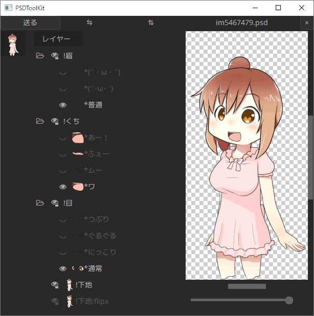
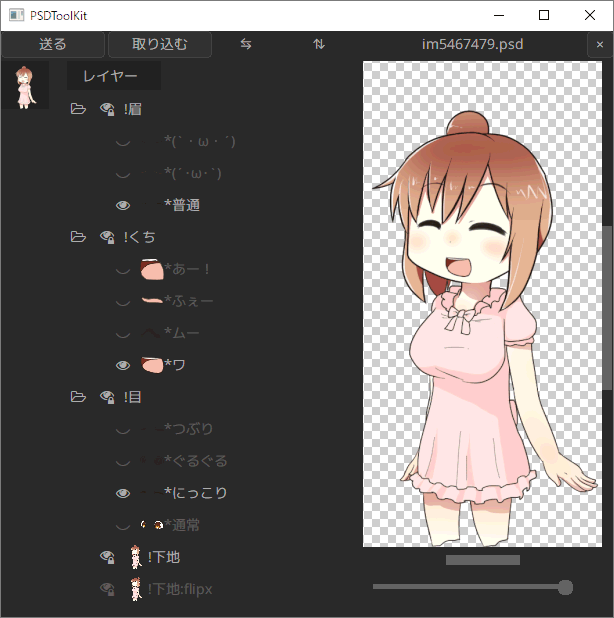
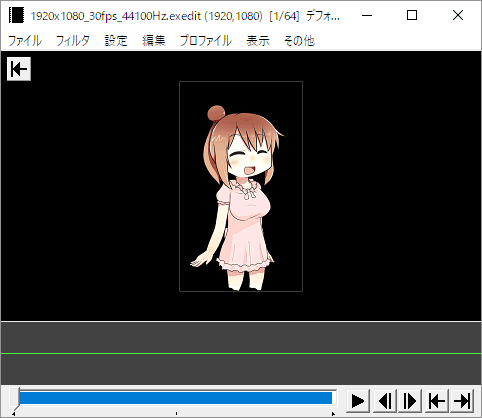
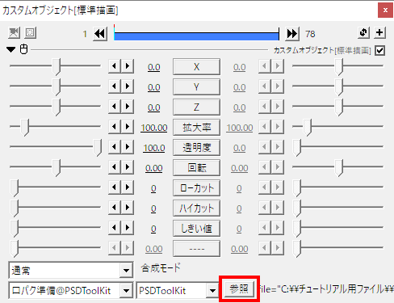
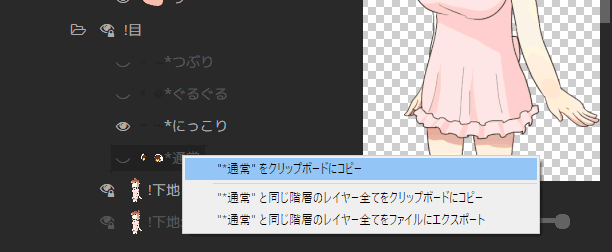
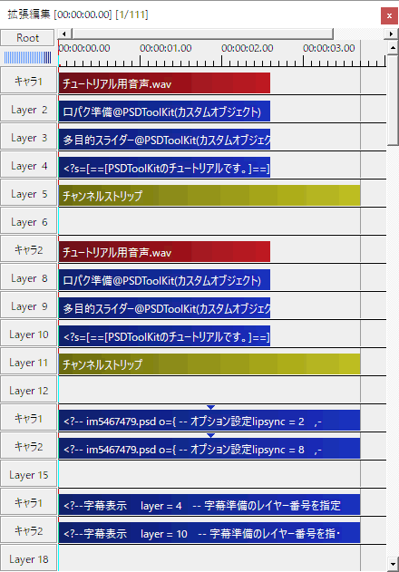

# このチュートリアルについて

このチュートリアルでは `AviUtl` と `拡張編集` と `PSDToolKit` の導入から、PSDToolKit が持つ機能の基本的な部分を一通り紹介していきます。

なお、仕組みへの理解を深めるためにチュートリアルの中ではあえて非効率な作業を行うシーンがあります。

# インストール

このチュートリアルでは AviUtl の導入先は `C:\AviUtl` とします。  
他のフォルダーでも基本的には動作しますが、フォルダー名が長すぎたり、日本語などが含まれていると動作しないことがあります。

[AviUtl の配布元サイト](http://spring-fragrance.mints.ne.jp/aviutl/)から `aviutl100.zip` と `exedit92.zip` をダウンロードし、`C:\AviUtl` へ解凍します。

そして `exedit.auf` と同じ場所へ `psdtoolkit_vX.X.zip` も解凍します。


完了すると `C:\AviUtl` の中身は上記のようになります。

## 上手く動かないときは

この先の手順でエラーダイアログが表示されたり上手く動いていないと思われる場合は以下が参考になるかもしれません。

- [エラーメッセージが表示される](faq.md#エラーメッセージが表示される)
- [拡張編集にファイルが投げ込めない](faq.md#拡張編集にファイルが投げ込めない)

## 設定の変更

使用を開始する前に、近年では一般的なサイズである 1920x1080 の動画を作れるように設定を変更します。

`aviutl.exe` をダブルクリックして起動します。


メニューから `ファイル`→`環境設定`→`システムの設定` を選び、`システムの設定` ダイアログを表示させます。

- `最大画像サイズ` の `幅` を `1920`、`高さ` を `1080` に設定
- `再生ウィンドウの動画再生をメインウィンドウに表示する` のチェックボックスをオン


設定が終わったら `OK` を押して `システムの設定` ダイアログを閉じ、設定内容を反映させるため AviUtl ウィンドウも閉じて終了させてください。

### おまけ: ショートカットキーの変更

この変更は必須ではありませんが、ショートカットキー `Ctrl + S` を `編集プロジェクトの上書き` に割り当てると、こまめな保存に便利です。

メニューから `ファイル`→`環境設定`→`ショートカットキーの設定` を選び、`ショートカットキー登録` ダイアログを表示させます。

1. 左のリストから `[ファイル][AVI出力 (Ctrl+S)]`を選択
2. 右のリストの一番上にある `なし` を選択
3. 左のリストから `[ファイル][編集プロジェクトの上書き]`を選択
4. 右のリストから `S` を選択し、更に `Ctrl` にチェックを付ける
5. `OK` ボタンを押してダイアログを閉じる


# 新規プロジェクトを作成

`aviutl.exe` をダブルクリックして起動します。


メニューから `設定`→`拡張編集の設定` を選び、`拡張編集` ウィンドウを表示させます。


拡張編集ウィンドウで右クリックメニューを出し、`新規プロジェクトの作成` を選びます。


表示された `新規プロジェクトの作成` ダイアログで画像サイズを `1920`×`1080` に設定します。


`OK` を押すと新規プロジェクトが作成されます。

それに合わせて AviUtl ウィンドウの大きさも広がるため、必要に応じて AviUtl ウィンドウのメニューから `表示`→`拡大表示`→`25%` を選ぶなど、見やすい大きさに調整してください。

# PSD ファイルの読み込み

今回使用する PSD ファイルを、以下のリンクからダウンロードしてください。

[im5467479.psd](https://oov.github.io/psdtool/img/im5467479.psd)（水梟るさん制作、一次配布元は[こちら](http://seiga.nicovideo.jp/seiga/im5467479)）  
<small>※動画制作に使用する場合は一次配布元の記載及び CeVIO キャラクターライセンスを厳守した上で利用してください。  
※[さとうささら](http://satosasara.com/)はトーク・ソング対応音声合成ソフトウェア [CeVIO Creative Studio](http://cevio.jp/) のキャラクターです。</small>

ダウンロードしたファイルを `拡張編集` ウィンドウへドラッグ＆ドロップして読み込みます。


するとタイムラインに [`PSD ファイルオブジェクト`](obj.md#PSD_ファイルオブジェクト) が追加されます。


この時点で AviUtl ウィンドウで表示されているプレビューは**動画の一番最初のフレーム**を表示しているため、タイムラインに追加されたアイテムがピッタリ左端にくっついていない場合はプレビューに現れません。

その場合はアイテムをドラッグして一番左にくっつけて、プレビューに画像が表示される状態にしてください。

## 画像が表示されないときは

このチュートリアルで使用している PSD ファイルでは起きませんが、他の PSD ファイルを読み込んだときに上手く表示されないことがあるかもしれません。

- PSD ファイル上でレイヤーが非表示になっている場合
  - 後述する方法でレイヤーの表示／非表示を切り替えてみてください。
- 画像の幅と高さが大きすぎて、画面外に描画されている場合
  - `描画@PSD` にある `縮小率` スライダーを使用して、画像を縮小してみてください。  
  ただし、このようなファイルは動画作成中も負荷が高くなる可能性があるため、はみ出している範囲がとても大きいときは PSD ファイルをお絵かきソフトなどで開いて予め縮小してから読み込むことも検討してみてください。

## レイヤーの切り替え

AviUtl のメニューから `編集`→`PSDToolKit`→`ウィンドウを表示` を選んで [`PSDToolKit ウィンドウ`](obj.md#PSDToolKit_ウィンドウ) を表示させます。



PSD ファイルにあるレイヤーの一覧が表示されています。

`!目` フォルダーの中にある `*にっこり` レイヤーをクリックしてください。



表情が変わりましたが、この時点ではまだ AviUtl 側には反映されていません。

左上にある `送る` ボタンを押してみてください。  
（`Ctrl + S` のショートカットキーでも押せます）


上手く反映されませんでした。

`PSD ファイルオブジェクト` と `PSDToolKit ウィンドウ` で編集している画像は **1対1 で対応しているわけではない**ので、設定を反映させるためには**どのオブジェクトに反映させるのか**を明確にしなければいけません。

改めて、`拡張編集` ウィンドウのタイムラインにある `PSD ファイルオブジェクト` をダブルクリックします。


するとプロパティが表示されます。


このウィンドウにある複数行テキスト入力欄が見えている間だけ、`送る` ボタンは動作します。

改めて `送る` ボタンを押してみてください。


今度は無事に変更が反映されました。

### ヒント: 前のパーツが非表示にならないときは

このチュートリアルで使用している PSD ファイルは[ラジオボタン化](https://oov.github.io/psdtool/manual.html#original-feature-asterisk)機能に対応しているためワンクリックでパーツの切り替えができますが、対応していないファイルでは前のパーツが自動的に非表示に切り替わったりはしません。

このような PSD ファイルでは前のパーツを手動で非表示にしてください。  
（[非表示にする際の注意点](faq.md#レイヤーが消えない_/_複数表示される_/_指定していないレイヤーが出る)）

なお、ラジオボタン化／反転レイヤー指定機能などは PSD ファイルに予め備わっているような機能ではないため、一般的な PSD ファイルはこの仕組みには対応していません。  
（[PSDTool の独自拡張機能](https://oov.github.io/psdtool/manual.html#original-feature)）

## 左右反転

`反転` と書かれた項目の左側にあるスライダーを `-1` から `1` に変更してみてください。




画像が左右反転されました。

また、画像をよく見比べてみると、単純に左右反転しただけではなく**髪の結び目の位置が変化**しています。

[反転時の特殊処理](https://oov.github.io/psdtool/manual.html#original-feature-flip)に対応した画像ではこのように内容自体が変わることがあるため、画像を反転したいときはこの機能を使うことが推奨されます。

## 目パチ（瞬き）

プロパティの右上にある `＋` ボタンを押して `アニメーション効果` を選択します。


一番下にアニメーション効果が追加されますが、`描画@PSD` のスライダー辺りを右クリックしてメニューを表示し、`フィルタ効果を下に移動` を選んで `描画@PSD` と位置を入れ替えます。


そしてコンボボックスを `震える` から [`目パチ@PSD`](psd.md#目パチ@PSD) へ変更します。


`設定` ボタンを押して `パラメータ設定` ダイアログを表示させます。


このダイアログを開いたままで、`PSDToolKit ウィンドウ` の `!目` の中にある `*通常` を右クリックしてメニューを表示させ、`"*通常" を「開き」に割り当て` を選びます。


同じように `*つぶり` も `閉じ` に割り当ててください。


正しく割り当てられていればこのようになります。

できたら `OK` を閉じてダイアログを閉じます。


目パチの設定前に表情を `*にっこり` に変更していましたが、`目パチ@PSD` により `*通常` で上書きされています。

右下にある5つのボタンのうち、左から2番目と3番目がそれぞれ `１コマ戻る` と `１コマ進む` ボタンなので、このボタンを使って目の表示が切り替わるのを確認してみてください。

また、目パチの `速さ` を `1` 以外にしてアニメーション速度を調節したり、`オフセット` の変更で目パチのタイミングを変えてみてください。

### ヒント: 目パチが上手く動かないときは

チュートリアル用に用意した PSD ファイルでは上手く動いても、他のファイルでは上手くいかないかもしれません。

そのようなときは以下の項目を参照してください。

- [レイヤーが消えない / 複数表示される / 指定していないレイヤーが出る](faq.md#レイヤーが消えない_/_複数表示される_/_指定していないレイヤーが出る)
- [アニメーションの動きが変](faq.md#アニメーションの動きが変)
- [設定が保存されない](faq.md#設定が保存されない)

## 口パク（リップシンク）

まずは、今回使用する音声ファイルなどを以下のリンクからダウンロードしてください。

[audio.zip](assets/audio.zip)  
<small>※この音声は [CeVIO Creative Studio](http://cevio.jp/) で [さとうささら](http://satosasara.com/) を使用して作成したものを加工したものです。  
※これらのファイルをこのチュートリアルを完了させるため以外の目的で使用することを禁止します。</small>

口パクには音量解析データが必要で、そのデータは [`口パク準備`](prep.md#口パク準備@PSDToolKit) を使うと作成できます。

`PSD ファイルオブジェクト` を `Layer 3` に移動します。

なお、**`口パク準備` は `PSD ファイルオブジェクト` より上のレイヤーに置く**必要があります。  
下だと描画後に音声解析データが割り当てられるため、表示への反映が１フレーム遅れることになります。


まずは音声ファイルをタイムラインの `Layer 1` にドラッグ＆ドロップで挿入します。


`音声ファイル` 自体は追加しなくても問題ありませんが、追加したほうが盛り上がります、気分が。

次に `拡張編集` ウィンドウでの右クリックメニューから `メディアオブジェクトの追加`→`PSDToolKit`→`口パク準備` を選び、`Layer 2` に `口パク準備` を挿入します。


挿入された `口パク準備` の位置や長さを調整して、音声と同じ範囲にしてください。また、`Layer 3` にある `PSD ファイルオブジェクト` はそれらよりも長くなるように変えます。


`口パク準備` をダブルクリックしてプロパティを表示させ、下にある `参照` ボタンを押して音声ファイルを選択します。



これで音量解析データが作成されるようになったので、このデータを利用して口パクを設定します。

まず `PSD ファイルオブジェクト` のテキスト入力欄にある `lipsync = 0` を `lipsync = 2` に書き換えます。  
<small>（`Layer 2` にある `口パク準備` を使うため）</small>


そして `目パチ` の時と同じ方法で [`口パク 開閉のみ@PSD`](psd.md#口パク_開閉のみ@PSD) を追加します。


もしダイアログが縦に長すぎる場合は左上にある `▼` ボタンを押すことで開閉できます。

`口パク 開閉のみ@PSD` にある `設定` ボタンを押して、口の開いた形と閉じた形を設定します。


この PSD ファイルには口を閉じた形は存在しないので、ここでは `*ふぇー` で代用しました。


再生ボタンを押すと、音声に合わせて口が動くのが確認できます。

### ヒント: 口パクが上手く動かないときは

チュートリアル用に用意した PSD ファイルや音声ファイルでは上手く動いても、他のファイルでは上手くいかないかもしれません。

そのようなときは以下の項目を参照してください。

- [レイヤーが消えない / 複数表示される / 指定していないレイヤーが出る](faq.md#レイヤーが消えない_/_複数表示される_/_指定していないレイヤーが出る)
- [アニメーションの動きが変](faq.md#アニメーションの動きが変)
- [口パクがほとんど開きっぱなしになる / ほとんど開かない](faq.md#口パクがほとんど開きっぱなしになる_/_ほとんど開かない)
- [口パクの動きが激しすぎる](faq.md#口パクの動きが激しすぎる)
- [設定が保存されない](faq.md#設定が保存されない)

# 字幕

音声に合わせて表示する字幕を作成します。

字幕も口パクと同じように準備オブジェクトが必要です。

`PSD ファイルオブジェクト` を `Layer 4` に移動し、右クリックメニューから `メディアオブジェクトの追加`→`PSDToolKit`→`字幕準備` を選び、`Layer 3` に [`字幕準備`](prep.md#字幕準備) を挿入します。

なお、**`字幕準備` は `字幕表示` より上のレイヤーに置く**必要があります。  
下だと描画後に字幕データが割り当てられるため、表示への反映が１フレーム遅れることになります。


`字幕準備` も音声と同じ範囲に設定します。

`字幕準備` のプロパティを開くとテキスト入力欄に `セリフ` と書かれた箇所があるので、これを字幕として表示したいテキストに書き換えます。


これで字幕のテキストデータが準備できたので、次は実際に表示を行います。

右クリックメニューから `メディアオブジェクトの追加`→`PSDToolKit`→`字幕表示` を選び、`Layer 5` に [`字幕表示`](obj.md#字幕表示) を挿入します。


そして `字幕表示` のプロパティのテキスト入力欄にある `layer = 1` を `layer = 3` に書き換えます。  
<small>（`Layer 3` にある `字幕準備` のデータを表示するため）</small>


あとは自由に表示の設定を変更して、読みやすい形にすれば設定完了です。


再生ボタンを押すと、喋っている間だけ字幕が表示されるのが確認できます。

# 口パク準備と字幕準備の配置を効率化

実際の動画制作においては `口パク準備` や `字幕準備` は音声とセットで大量に配置することになるため、これを効率的に配置できるようにします。

AviUtl のメニューから `編集`→`PSDToolKit`→`環境設定` を選び `PSDToolKit 環境設定` ダイアログを開きます。


上記の画像のように `「口パク準備」を生成` と `「字幕準備」を生成` にチェックをつけ `OK` を押して閉じます。


`*.wav` ファイルだけを上記のように投げ込むと `口パク準備` と `字幕準備` が自動的に生成され、`字幕準備` には同じ名前の `*.txt` ファイルの内容が書き込まれた状態になります。

ファイルをつかむ前から `Shift キー` を押してしまうとエクスプローラーなどの挙動が変わってしまい、上手くつかめないことがあるので注意してください。

これで今後は `*.wav` ファイルと同じ名前の `*.txt` ファイルさえあれば、`Shift キー` を押すだけで `口パク準備` と `字幕準備` が作成できるようになりました。

なお上記のスクリーンショットでは `PSD ファイルオブジェクト` と `字幕表示` のアイテムの長さが足りていないので、きちんと画像や字幕を表示させるためにはそれらの長さの調節も必要です。

## ヒント: 口パク準備の設定の簡略化

音声ファイルの内容によっては口パク準備のプロパティを変更する必要がありますが、１つ１つに違う値を設定するのではなく一括で同じ値を設定したいときは、[`PSD ファイルオブジェクト` にある `ls_locut`/`ls_hicut`/`ls_threshold`/`ls_sensitivity` の設定](obj.md#PSD_ファイルオブジェクト)を使うと一気に上書きできます。

## ヒント: 字幕のテキストを自動で置換

[`setting.lua` を作成](setting.md#設定のカスタマイズ)し、[`P:wav_subtitle_replacer`](setting.md#P:wav_subtitle_replacer) の設定を行うことで実現できます。

## ヒント: ファイルをドロップする作業自体の効率化

作成した音声ファイルを Shift キーを押しながらドロップするのが面倒なら、[`かんしくん`](forcepser.md) を利用することで、AviUtl の現在のカーソル位置に作成されたファイルを自動で挿入することもできます。

# 動画の途中で表情を変更するために

ここまでの内容で、目パチしながら音声に合わせて口パクし、同時に字幕が出せるようになりました。

さらに `*.wav` ファイルの追加時に自動で `口パク準備` と `字幕準備` が作成できるようになったので、音声ファイルをどんどん加えるだけでちょっとした動画を作ることができるようになりました。

しかし、このままでは途中で表情の変更ができません。  
<small>（アイテムを分割すれば変えられますが、それは物理的に増やしているので途中とは言えません）</small>

また `目パチ` を設定した際に起きたように、目のパターンを `*にっこり` にしても `目パチ` が表示を上書きしてしまうなど、同じ箇所のパーツを複数箇所で設定すると煩わしい部分もあります。

ここからはこの PSD ファイル専用のアニメーション効果を作成することで、編集時の作業効率の改善を図ります。

# *.anm ファイルを作成する

PSD ファイルから `*.anm` ファイルを作成します。

`PSDToolKit ウィンドウ` で `!眉` の中にある `*普通` を右クリックしてメニューを表示し、`"*普通" と同じ階層にあるレイヤー全てをファイルにエクスポート` を選びます。


するとファイルに名前をつけて保存するためのダイアログが表示されるので、今回はそのまま `保存` を押します。


保存したファイルを読み込ませるためには AviUtl の再起動が必要になりますが、現在編集中のプロジェクトを一度も保存していないので、ここで保存しておきましょう。

AviUtl のメニューから `ファイル`→`編集プロジェクトの保存` を選び、好きな場所に好きな名前で保存してください。

その後 AviUtl を閉じ、改めて起動して、AviUtl のメニューから `ファイル`→`最近使ったファイル`→`（保存したプロジェクト名）` を選んでプロジェクトファイルを開き直してください。

そして `PSD ファイルオブジェクト` から `目パチ@PSD` と `口パク 開閉のみ@PSD` を削除（右クリックメニューから `フィルタ効果の削除`）し、新しく `アニメーション効果` を追加して、`描画@PSD` を下に移動し、さっきエクスポートしたファイルの名前を選択します。


このような状態になります。

`!眉` のスライダーは `0` ～ `3` の範囲で選ぶことができ、`0` のときはこのスライダーでは上書きせずに元々の表示を優先します。

このスライダーを使うことによって、もう `PSDToolKit ウィンドウ` に切り替えなくてもパーツを変更できるようになりました。

## 他のスライダーを有効化する

`!眉` の下にはまだ有効化されていないスライダーがあるので、これに他のパーツも割り当てていきます。

`メモ帳` を起動し、さっき作成した `C:\AviUtl\script\im5467479-!眉.anm` を `メモ帳` へドラッグ＆ドロップして読み込みます。


今度は `!目` の中にある `*通常` を右クリックしてメニューを表示し、`"*普通" と同じ階層にあるレイヤー全てをクリップボードにコピー` を選びます。


コピーした内容をテキストの下に貼り付けます。


貼り付けたテキスト内の `track0` を `track1` に書き換えます。  
<small>（最初のスライダーが `track0` で、次のスライダーが `track1` だから）</small>


そして `--track1` から始まる行を上に移動して、`--track0` と並べます。


同じ流れで `!くち` の項目も増やしましょう。


これでメモ帳を上書き保存し、AviUtl のプロジェクトも上書き保存し、AviUtl を閉じて、改めて起動し、プロジェクトを読み込みます。


スライダーが3つ使えるようになりました。

スライダーを操作すると、それぞれのパーツが切り替わることが確認できます。

### ヒント: スライダーが4つでは足りない場合

`*.anm` ファイル自体を複数用意することで、もっとたくさんのパーツを使うことが可能です。

また、拡張編集の制限によりひとつのオブジェクトに追加できるフィルター効果は10個までですが、`描画@PSD` を削除して下のレイヤーに配置すればもっとたくさんの効果を使うこともできます。

### ヒント: パーツがひとつのフォルダーにまとまっていないときは

PSD ファイルによっては、例えば目のパーツが２箇所以上のフォルダーに分かれて存在するようなケースもあります。

このような場合は一括登録はできませんが、必要な数だけ項目を追加し、`--track0` などの行にあるスライダーの最大値も足した数だけ増やせば、変則的な構成でも対応可能です。

```lua
--track0:!目,0,9,0,1
--             ↑5個足したので最大値も 4 + 5 = 9 に書き換え
local values = {
  "v1.!目/*通常",
  "v1.!目/*にっこり",
  "v1.!目/*ぐるぐる",
  "v1.!目/*つぶり",
  "v1.!目2/*追記1", -- ここから下が追加したレイヤー
  "v1.!目2/*追記2",
  "v1.!目2/*追記3",
  "v1.!目2/*追記4",
  "v1.!目2/*追記5",
}
PSD:addstate(values, obj.track0)
```

ただしこのようなケースではそもそもレイヤー管理が煩雑になる可能性が高いため、PSD ファイル側を編集したり[シンプルビューを利用](pfv.md)して対応したほうが、結果的に簡単に解決するかもしれません。

## 目パチを追加する

さっき削除した `目パチ@PSD` を、改めてスライダーの項目のひとつとして追加します。

[このリンクを右クリックして新しいウィンドウで開き](psd.md#目パチ_を_Lua_スクリプトから使う)、入力用フォームを表示します。



`目パチ` に割り当てたいパーツを右クリックしてコピーし、ブラウザ側の入力欄に貼り付けます。


前回と同じように、`*通常` と `*つぶり` をそれぞれ `開き` と `閉じ` に割り当てました。

その他、必要に応じて `速さ` なども変更してください。

入力が終わったらクリップボードにコピーし、メモ帳に貼り付けます。

そして**その後ろにカンマ `,` を加えます**。


`!目` の項目をひとつ書き足したので、`!目` のスライダーの最大値を `4` から `5` に書き換えます。


これで `!目` のスライダーが `1` の時には目パチを行い、`2`～`5` の時はその目のパターンを表示するようになりました。

必要に応じてこの目パチはいくつでも登録することができます。

## 口パクを追加する

口パクも目パチと同様の手順で行えます。

[このリンクを右クリックして新しいウィンドウで開き](psd.md#口パク_開閉のみ_を_Lua_スクリプトから使う)、入力用フォームを表示します。

あとの作業内容は同じなので省略します。

```lua
--track0:!眉,0,3,0,1
--track1:!目,0,5,0,1
--track2:!くち,0,5,0,1

local values = {
  "v1.!眉/*普通",
  "v1.!眉/*(´･ω･`)",
  "v1.!眉/*(`・ω・´)",
}
PSD:addstate(values, obj.track0)

local values = {
  require("PSDToolKit").Blinker.new({"v1.!目/*つぶり","v1.!目/*通常"},4,1,0),
  "v1.!目/*通常",
  "v1.!目/*にっこり",
  "v1.!目/*ぐるぐる",
  "v1.!目/*つぶり",
}
PSD:addstate(values, obj.track1)

local values = {
  require("PSDToolKit").LipSyncSimple.new({"v1.!くち/*ふぇー","v1.!くち/*ワ"},1,true),
  "v1.!くち/*ワ",
  "v1.!くち/*ムー",
  "v1.!くち/*ふぇー",
  "v1.!くち/*あー！",
}
PSD:addstate(values, obj.track2)
```

ここまでの編集が終わった段階で、メモ帳の中は概ね上記のような内容になります。

それでは改めてメモ帳を上書き保存し、AviUtl のプロジェクトも上書き保存し、AviUtl を閉じて、改めて起動し、プロジェクトを読み込みます。


スライダーを上記のように設定すると目パチと口パクが動き、`1` 以外にすれば目パチなどで上書きされずに他のパターンも表示できるようになりました。

# 途中で表情を変更する

`PSD ファイルオブジェクト` の表情用のスライダーの名前をクリックして、`瞬間移動` を選択します。


これで右側のスライダーが使えるようになります。

次に、`PSD ファイルオブジェクト` のアイテムを真ん中あたりを右クリックし、`中間点を追加` を選択します。


プロパティ表示中のアイテムに表示される点線が、全体ではなく中間点を境目として表示されるようになりました。


点線の左側が左側のスライダー、点線の右側が右側のスライダーに対応しています。

そのため、例えば上記の状態で左側のスライダーを `1` 右側のスライダーを `3` に設定すると、前半は `1` で、後半は `3` で表示されるようになります。

このように中間点を追加することで、タイムラインの途中で表情の切り替えができるようになりました。

# 多目的スライダー

中間点を使った表情の切り替えも有用ですが、その他に「一時的に変更し、あとで戻す」という用途に特化した機能もあり、「喋っている間だけ表情を切り替える」といった形で表情を切り替えたい場合には大変有用です。

`Layer 3`～`Layer 5` にあるアイテムを一段下にずらし、`拡張編集` ウィンドウでの右クリックメニューから `メディアオブジェクトの追加`→`PSDToolKit`→`多目的スライダー` を選び、[`多目的スライダー`](prep.md#多目的スライダー@PSDToolKit) を `Layer 3` に挿入します。

なお、**`多目的スライダー` は `PSD ファイルオブジェクト` より上のレイヤーに置く**必要があります。  
下だと描画後に多目的スライダーのデータが割り当てられるため、表示への反映が１フレーム遅れることになります。


追加した `多目的スライダー` の範囲を音声と同じにします。

また、`字幕準備` の位置が変わったので `字幕表示` のテキスト入力欄で `layer = 3` を `layer = 4` に修正しておきます。  
<small>（`Layer 4` にある `字幕準備` を使うため）</small>

そして `PSD ファイルオブジェクト` のテキスト入力欄で、`mpslider = 0` を `mpslider = 3` に書き換えます。  
<small>（`Layer 3` にある `多目的スライダー` を使うため）</small>


これで多目的スライダーが使えるようになりました。


`多目的スライダー` には名前がないスライダーが予め8つ用意されており、名前や項目数は連動していないものの、上から順に `!眉` `!目` `!くち` のスライダーが割り当てられていて、`0` 以外の値を指定するとスライダーの値を一時的に上書きできます。

試しに名前がない2番目のスライダーを `5` に変更してみてください。


喋っている間は一時的に `!目` が `*つぶり` になりますが、その範囲が終了すると元々の表情に戻ります。

この機能は中間点を追加する方法の代わりとして使うこともできますし、併用することもできます。  
もちろん音声と同じではない範囲に設定することもでき、更には多目的スライダーに中間点を追加して使うようなこともできます。

# 多目的スライダーの配置を効率化

`口パク準備` や `字幕準備` と同じように `多目的スライダー` も音声と一緒に自動で配置することができます。

[口パク準備と字幕準備の配置を効率化](#口パク準備と字幕準備の配置を効率化)の時に使ったダイアログで `「多目的スライダー」を生成` にチェックを入れれば、`多目的スライダー` も自動的に生成されるようになります。

# 準備オブジェクトの集約

ここまでの作業で、`Layer 2` から `Layer 4` を準備用のオブジェクトが専有するようになりました。


この状態なら、例えば長い音声に合わせて `字幕準備` の分割を行ったり、`多目的スライダー` だけ長さを伸ばして複数のセリフに渡る表情を作ったりすることもできるため、これはこれでメリットがあります。

しかしそのような操作が全く必要ない場合には、これらをひとつのレイヤーに集約させることができます。

AviUtl のメニューから `編集`→`PSDToolKit`→`環境設定` を選び `PSDToolKit 環境設定` ダイアログを開き、`すべての準備オブジェクトを単一のオブジェクトへ統合` にチェックを入れます。


これで、今後追加される準備オブジェクトはひとつの [`統合準備オブジェクト`](prep.md#統合準備オブジェクト) に集約されるようになります。  
<small>（つまり、今まで配置されたものが勝手に変更されることはありません）</small>


[`統合準備オブジェクト`](prep.md#統合準備オブジェクト) にはすべての機能が含まれているため、例えばこの場合だと `口パク準備` も `多目的スライダー` も `字幕準備` も**すべて `Layer 2` に配置**されている状態になります。

そのため、基本的に未統合のものとは併用できないため注意してください。

# ブラッシュアップ

ここまでで、PSDToolKit が持つ機能を活用した基本的なチュートリアルは完了です。

表情変更をスライダーだけで行えるようになり、更には発言中だけ表情を切り替えるようなことも簡単になったので、表情がコロコロ変わる動画を作るのも簡単になりました。

ここからは、更に細かい部分に目を向けていきます。

# 喋っている間だけ画像を表示させる

メインのコンテンツがキャラクターではなく同時に流している動画などである場合には、キャラクターを常に表示するのは避けたいこともあるかも知れません。

`口パク準備` か `多目的スライダー` を使っているならば、`subobj アニメーション効果` を使うことで手間なくそれを実現できます。

`PSD ファイルオブジェクト` に、[`基本登場@subobj`](subobj.md#基本登場@subobj) を２つ登録します。


これは PSD ファイルのレイヤーを変更するためのものではないので `描画@PSD` よりも下に配置します。  
また、下の `基本登場@subobj` の `速さ(秒)` にマイナスの値を指定することで、退場用の効果として設定しています。


これだけで、`多目的スライダー` がある範囲に合わせて自動的に登場／退場用のエフェクトが掛かるようになりました。  
なお `口パク準備` しか使っていないときは `口パク準備` がある範囲が対象になります。

設定を変更したり、`基本登場@subobj` 以外のアニメーション効果も試してみてください。

# 字幕の表示に演出を追加する

字幕の文字も、ただ表示するだけではなく登場と退場に効果を加えることができます。


`字幕表示` の `文字毎に個別オブジェクト` にチェックを付けて、更に `フェード@subobj` のアニメーション効果を追加します。


これだけで１文字ずつフェードインするようになりました。

# 音声フィルタ

ここからは音声に対する処理について紹介します。

## 音量を上げたことによる音割れの回避

試しに、音声ファイルのプロパティで `音量` を `400` に設定して試聴してみてください。  
（元の4倍の音量になるので大音量に注意してください）


とても大きな音が出ますが、それ以上に**音が割れ**て不自然な鳴り方になりました。

拡張編集では限界（ピーク）を超えて音量を上げようとすると、音が割れてしまいます。

さっき変えた `音量` を `100` に戻し、`Layer 5` ～ `Layer 6` のオブジェクトをひとつ下に移動し、拡張編集の右クリックメニューから `フィルタオブジェクトの追加`→`チャンネルストリップ` を選び、`Layer 5` に [`チャンネルストリップ`](audio.md#チャンネルストリップ) を挿入します。


長さを調整して、字幕表示などと合わせます。


次に `チャンネルストリップ` のプロパティで `ID` を `0` に、そして試しに `出力音量` を `10000` にしてみてください。  
（`出力音量` を `10000` にすると4倍の音量に相当します）


視聴してみると、先程よりは幾分聞き取りやすい状態になりました。

`音声ファイル` ではなく `チャンネルストリップ` で音量を上げれば、音が割れるほどの音量になったときは自動的に音量が絞られるようになります。

## 複数の音声による音割れの回避

複数の音声が同時に流れるようなときは、音量を上げていなくてもピークを超えて音が割れてしまうことがあります。  
例えばゲームの音声に合わせて喋るようなときは、いつ音割れが起きるのか予測するのが困難です。


このようなときはそれぞれの音声に `チャンネルストリップ` を通すことによって、ある程度回避できます。


チャンネルストリップの `ID` は、処理したい音声の塊ごとに `0` 以上の固有の番号を割り当てて使います。  
（同じフレーム内で同じ ID を使ってしまうと音が鳴らなくなります）

また、複数のチャンネルストリップを配置したときは、前のチャンネルストリップから次のチャンネルストリップまでの間に設置された `音声ファイル` が処理対象になります。

そのためこのように `チャンネルストリップ` を３つ設定した場合は、黄色く着色されたゾーンがそれぞれの `チャンネルストリップ` の影響範囲になります。

この例だと `あいさつ.wav` と `あいさつ2.wav` は `ID` が `1` の `チャンネルストリップ` によって処理されます。  
`あいさつ.wav` と `あいさつ2.wav` は同時に再生されない配置になっているため、同じチャンネルストリップで処理しても音が割れてしまう心配はありません。

## ヒント: 最初から音が割れている *.wav ファイル

加工する前から音が割れてしまっているファイルは、既に必要な情報が失われた状態なので元に戻すことはできません。

## その他のエフェクトについて

ゲーム映像に合わせて喋るような動画を作る場合は、ゲームの音と声が被って聞き取りづらくなることがあります。

試しに `EQ HiGain` を `10000` にしてみてください。

これは極端な変更なので実際の動画で使うべき設定ではありませんが、再生して音を確認すると、声が明るい音に変化します。

このようにイコライザーを使って高い周波数を強調すると音が目立ちやすくなりますが、同時に耳障りにもなるため気をつけて使ってください。

# 終わりに

キャラクターが2人になったときは、おそらく以下のような構成が基本形になるでしょう。  
見通しを良くするために余白も含んでいます。



`Layer 1` ～ `Layer 12` までは、**画面に表示されないオブジェクトだけ**が置いてあります。

これらのオブジェクトが置いてあるレイヤー番号は `PSD ファイルオブジェクト` や `字幕表示` で番号を指定する必要があるので、配置するレイヤーをコロコロ変えるような使い方には適していません。  
そのため、最初から最後まで一貫して同じレイヤーに置けるよう、最初に全て置いてしまうのが簡単です。

そのあとで `PSD ファイルオブジェクト` や `字幕表示` を置けば、重ね合わせ順を変えるのも容易です。

もちろん全てルートシーン上に置く必要はないので、PSD ファイルオブジェクトに関連するものを置く専用のシーンを作ったり、キャラクターごとにシーンを分けたりすることもできますが、これはこれで作業効率が犠牲になる側面があるので扱い方には注意が必要です。
